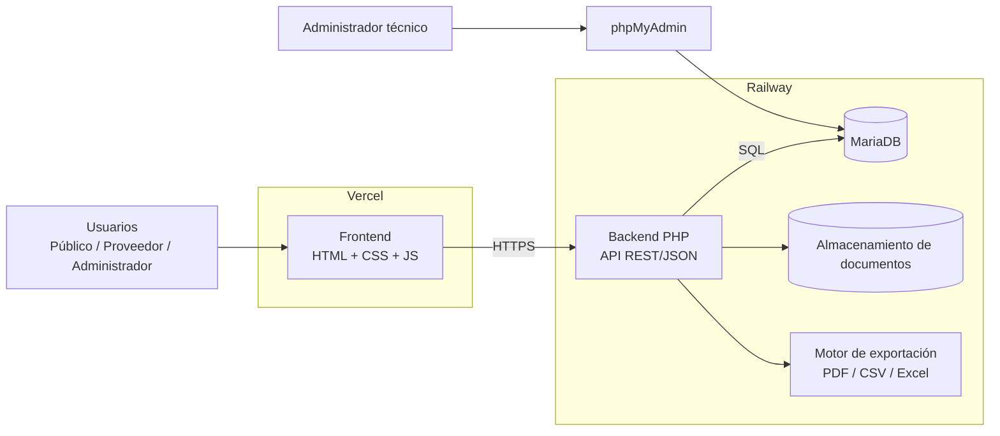
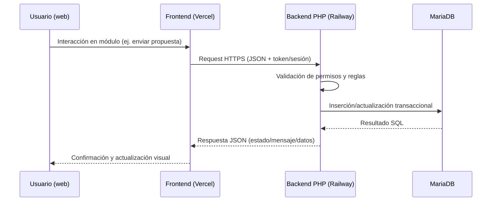

# Arquitectura e Infraestructura Propuesta  
## Sistema de Gestión del Procedimiento de Licitación de Obra Pública y Procesos de Contratación

## 1. Objetivo de la arquitectura
Definir una arquitectura web clara, escalable y mantenible para soportar los módulos del sistema de licitaciones (convocatorias, proveedores, propuestas, evaluación, adjudicación, reportes y trazabilidad), usando tecnologías **vanilla**:

- Frontend: **HTML + CSS + JavaScript puro**
- Backend: **PHP puro**
- Base de datos: **SQL (MariaDB)**
- Administración de BD: **phpMyAdmin**
- Hosting Frontend: **Vercel**
- Hosting Backend + BD: **Railway**

---

## 2. Vista general (alto nivel)

La solución se organiza en 3 dominios conectados:
1. **Canal de acceso**: usuarios interactúan con el frontend web publicado en Vercel.
2. **Núcleo transaccional**: el backend PHP en Railway aplica reglas de negocio, validaciones y seguridad.
3. **Persistencia y administración**: MariaDB almacena datos del proceso y phpMyAdmin facilita la operación técnica.

Los documentos y exportaciones se gestionan desde backend para mantener control, trazabilidad y consistencia institucional.



---

## 3. Arquitectura lógica por capas

### 3.1 Capa de presentación (Frontend - Vercel)
- Aplicación web responsiva construida en HTML, CSS y JS.
- Interfaz separada por vistas/módulos:
  - Convocatorias
  - Registro de proveedores
  - Recepción de propuestas
  - Evaluación
  - Adjudicación y contratos
  - Reportes y tablero
- Consumo de API vía `fetch` sobre HTTPS (JSON).
- Manejo de sesión/token según mecanismo definido por backend.
- Renderizado de gráficos en cliente.

### 3.2 Capa de negocio (Backend PHP - Railway)
- API REST en PHP puro para exponer operaciones CRUD y flujos del proceso de licitación.
- Implementación de reglas de negocio:
  - Control de acceso por rol.
  - Validaciones obligatorias por módulo.
  - Estado y transición del proceso de licitación.
  - Auditoría y trazabilidad de acciones.
- Gestión de documentos asociados (bases, propuestas, contratos, actas).
- Generación de reportes y exportaciones.

### 3.3 Capa de datos (MariaDB - Railway)
- Motor relacional para consistencia transaccional del proceso.
- Entidades principales (alineadas al análisis funcional):
  - `usuarios`, `roles`, `permisos`
  - `licitaciones`, `convocatorias`
  - `proveedores`
  - `propuestas_tecnicas`, `propuestas_economicas`
  - `evaluaciones`, `dictamenes`
  - `adjudicaciones`, `contratos`
  - `documentos`
  - `historial_cambios` (auditoría)
- Administración operativa mediante phpMyAdmin.

---

## 4. Infraestructura de despliegue (física/lógica)

### 4.1 Frontend (Vercel)
- Hosting estático del cliente web (HTML/CSS/JS).
- Entrega por CDN y HTTPS.
- Variables de entorno para URL base del backend.
- Despliegues continuos por rama principal (si se configura CI/CD).

### 4.2 Backend y Base de Datos (Railway)
- Servicio PHP desplegado como API del sistema.
- Servicio MariaDB en la misma plataforma para simplificar conectividad inicial.
- Variables seguras para credenciales (`DB_HOST`, `DB_PORT`, `DB_NAME`, `DB_USER`, `DB_PASS`).
- Conexión backend-BD en red privada de Railway cuando sea posible.

### 4.3 Herramientas de administración
- phpMyAdmin para operación de base de datos:
  - Consulta y soporte de datos.
  - Mantenimiento operativo.
  - Verificación rápida de integridad de registros.

---

## 5. Flujo principal de operación



---

## 6. Reportes, gráficos y exportaciones (excepciones permitidas)
Dado que se mantiene enfoque vanilla, se recomienda incorporar librerías puntuales únicamente para estas capacidades:

- **Gráficos**: Chart.js o equivalente.
- **PDF**: jsPDF / TCPDF / Dompdf (según se genere en frontend o backend).
- **Excel/CSV**:
  - CSV: generación directa (backend/frontend).
  - Excel: PhpSpreadsheet (backend) o SheetJS (frontend).

> Recomendación práctica: centralizar exportaciones oficiales (PDF/Excel) en backend PHP para mejor control de formato, seguridad y trazabilidad.

---

## 7. Seguridad y gobierno de datos
- Autenticación y autorización basada en roles (Público, Proveedor, Administrador).
- Hash seguro de contraseñas (`password_hash` en PHP).
- Validación de entradas y consultas preparadas (PDO) para mitigar SQL Injection.
- Protección de archivos cargados (validación de tipo/tamaño y rutas controladas).
- Registro de auditoría por operación crítica (alta, edición, evaluación, adjudicación).
- Uso obligatorio de HTTPS entre frontend y backend.
- Respaldos periódicos de MariaDB.

---

## 8. Estructura sugerida de componentes backend (PHP puro)

```text
/public
  index.php
/app
  /controllers
  /services
  /repositories
  /models
  /middlewares
  /helpers
/storage
  /documents
    /uploads
      /2026
        /enero /febrero /marzo /abril /mayo /junio /julio /agosto /septiembre /octubre /noviembre /diciembre
      /2025
        /enero /febrero /marzo /abril /mayo /junio /julio /agosto /septiembre /octubre /noviembre /diciembre
      ...
      /2020
        /enero /febrero /marzo /abril /mayo /junio /julio /agosto /septiembre /octubre /noviembre /diciembre
    /exports
      /2026
        /enero /febrero /marzo /abril /mayo /junio /julio /agosto /septiembre /octubre /noviembre /diciembre
      /2025
        /enero /febrero /marzo /abril /mayo /junio /julio /agosto /septiembre /octubre /noviembre /diciembre
      ...
      /2020
        /enero /febrero /marzo /abril /mayo /junio /julio /agosto /septiembre /octubre /noviembre /diciembre
/config
  database.php
  app.php
```

Donde:
- `uploads/` almacenará documentos cargados al sistema (PDF, Excel, CSV, etc.).
- `exports/` almacenará documentos generados por el sistema (reportes PDF, archivos Excel/CSV, etc.).
- En ambos casos, la organización será histórica por tiempo: **año/mes** (de 2020 en adelante), para facilitar trazabilidad, búsquedas y respaldo.

Esta organización permite separar responsabilidades sin depender de frameworks, facilitando pruebas, mantenimiento y crecimiento del sistema.

### 8.1 Estructura sugerida de componentes frontend (HTML/CSS/JS puro)

```text
/frontend
  /public
    index.html
    login.html
    dashboard.html
  /assets
    /css
      styles.css
      components.css
    /js
      app.js
      api-client.js
      auth.js
      validators.js
      charts.js
    /img
  /views
    /convocatorias
    /proveedores
    /propuestas
    /evaluacion
    /adjudicaciones
    /reportes
```

Esta estructura separa recursos estáticos, lógica JavaScript y vistas por módulo, manteniendo orden y mantenibilidad en un enfoque vanilla.

---

## 9. Escalabilidad y evolución esperada
- **Corto plazo**: monolito modular (frontend separado + API PHP + MariaDB).
- **Mediano plazo**:
  - Separar almacenamiento de documentos a servicio especializado.
  - Implementar cola para tareas pesadas (reportes masivos).
  - Réplicas de lectura para reportes analíticos.
- **Largo plazo**:
  - Descomponer módulos críticos en servicios independientes si la carga lo requiere.

---

## 10. Resumen ejecutivo
La arquitectura propuesta implementa un esquema **cliente-servidor de 3 capas**, con frontend en **Vercel**, backend y base de datos en **Railway**, y administración de datos con **phpMyAdmin**.  
Cumple con los requerimientos funcionales y de control del proceso de licitación, priorizando trazabilidad, seguridad, exportación de información y simplicidad técnica bajo un enfoque de desarrollo **vanilla (sin frameworks)**.
