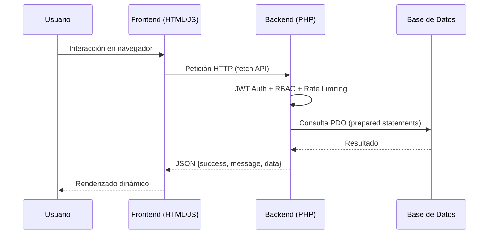
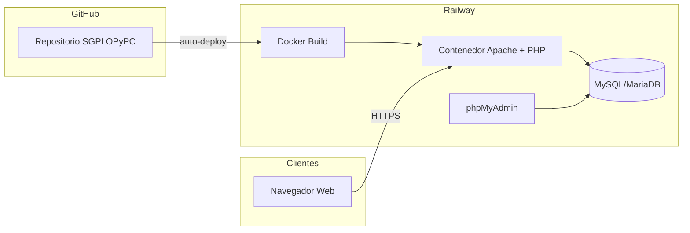
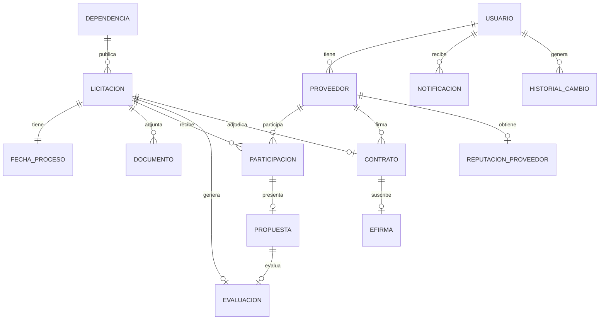
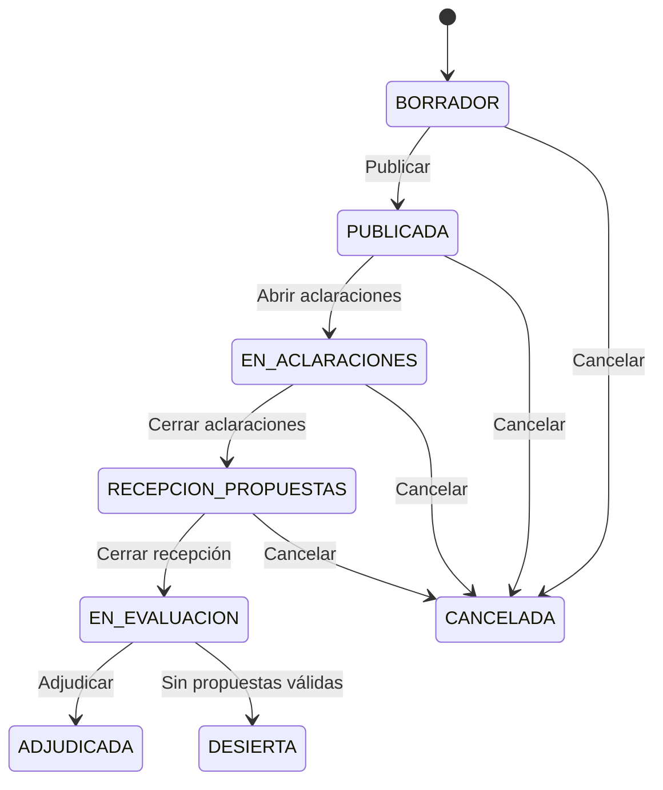

---

<div align="center">

**Instituto Tecnológico Superior Campus Perote**

**Ingeniería Informática**

**Desarrollo de Aplicaciones Web**

---

### Manual Técnico | SGPLOPYPC

**Sistema de Gestión del Procedimiento de Licitación de Obra Pública y Procesos de Contratación**

---

Karol Nahum Delgado Bernal | 23050014
Alexis Aburto Mendez | 23050005
Victor Ricardo Herrera Galindo | 23050008
Gonzalo Rodriguez Hernandez | 23050010
Katia Esteban Soto | 23050016
Jose Antonio Contreras Flores

**Grupo: 605 - A**

</div>

---

## 1. Propósito y alcance del sistema

SGPLOPyPC (Sistema de Gestión del Procedimiento de Licitación de Obra Pública y Procesos de Contratación) es una plataforma web diseñada para gestionar de forma integral los procesos de licitación de obra pública y contrataciones gubernamentales.

El sistema tiene como objetivos principales:

- **Digitalizar** los procedimientos administrativos de licitación y contratación pública.
- **Mejorar la transparencia** mediante paneles de datos abiertos y trazabilidad completa de acciones.
- **Optimizar la eficiencia** en la recepción, evaluación y adjudicación de propuestas.
- **Garantizar la seguridad** de la información y el control de acceso por roles.
- **Generar reportes** y documentos oficiales en múltiples formatos (PDF, DOCX, CSV).

### 1.1 Alcance funcional

| Ámbito | Descripción |
|--------|-------------|
| Licitaciones/Convocatorias | Creación, publicación, gestión de estados y cierre |
| Proveedores | Registro, perfil, validación y métricas de reputación |
| Participaciones y Propuestas | Inscripción a licitaciones, envío y retiro de propuestas |
| Evaluación | Dictámenes técnicos y calificación de propuestas |
| Contratos | Generación, seguimiento, firma y cumplimiento |
| Documentos | Carga, descarga, versionado y gestión documental |
| Reportes | Exportación CSV, generación PDF/DOCX, indicadores de dashboard |
| Datos Abiertos | API OCDS para transparencia y de datos |
| Notificaciones | Eventos en tiempo real mediante SSE |
| Auditoría | Registro completo de acciones sobre el sistema |

---

## 2. Descripción funcional general

SGPLOPyPC opera como una aplicación client-server de tres capas:

1. **Capa de presentación**: Interfaz HTML/CSS/JavaScript vanilla, servida como archivos estáticos.
2. **Capa de negocio**: API RESTful en PHP puro, sin framework, con controladores, servicios y repositorios.
3. **Capa de persistencia**: Base de datos MySQL/MariaDB con esquema relacional.

El sistema se comunica mediante peticiones HTTP/HTTPS. El frontend consume la API REST a través de `fetch()` y no utiliza frameworks JavaScript.

### 2.1 Flujo principal de operación



---

## 3. Stack tecnológico

| Capa | Tecnología | Versión/Detalle |
|------|------------|-----------------|
| Lenguaje backend | PHP | >= 8.1 (recomendado 8.2) |
| Frontend | HTML, CSS, JavaScript vanilla | Sin frameworks SPA |
| Estilos | Tailwind CSS | v3.4.x (compilado vía Node.js) |
| Base de datos | MySQL / MariaDB | Motor InnoDB, charset utf8mb4 |
| Generación de PDF | Dompdf | ^3.0 |
| Generación de DOCX | PhpWord | ^1.3 |
| Autenticación | JWT (HMAC-SHA256) | Implementación propia |
| Despliegue | Railway (contenedor Docker) | Builder DOCKERFILE |
| Contenedor | Docker | PHP 8.2-apache |
| Servidor web | Apache (mpm_prefork) | Dentro del contenedor |
| Testing E2E | Playwright | Tests en `e2e/` |
| Diagramas | Mermaid | En documentación |

### 3.1 Decisiones técnicas relevantes

| Decisión | Motivo | Impacto operativo |
|----------|--------|-------------------|
| PHP puro (sin framework) | Control total, dependencias mínimas, aprendizaje | Mayor responsabilidad en patrones; sin ORM ni routing automático |
| Vanilla JS (sin React/Vue) | Carga rápida, sin build step, compatibilidad amplia | Menor abstracción; UI más directa pero menos reutilizable |
| JWT propio (sin librerías externas) | Dependencia cero, transparencia total del mecanismo | Mantenimiento propio del estándar; responsable de seguridad |
| Docker + Railway | Despliegue consistente, escalable, integración con GitHub | Requiere Dockerfile mantenible; Railway maneja HTTPS y DNS |
| Tailwind CSS vía CDN | Desarrollo ágil de UI; CDN para desarrollo | En producción se compila localmente vía Node.js |

---

## 4. Arquitectura del sistema

### 4.1 Arquitectura lógica por capas

```
┌─────────────────────────────────────────────────────────┐
│                  CAPA DE PRESENTACIÓN                   │
│   Frontend HTML/CSS/JS  ·  Archivos estáticos           │
│   public/  ·  frontend/admin  ·  frontend/proveedor     │
│   frontend/publico  ·  frontend/auth  ·  frontend/shared│
└────────────────────────┬────────────────────────────────┘
                         │ HTTP (fetch API)
┌────────────────────────▼────────────────────────────────┐
│                   CAPA DE NEGOCIO                       │
│   API RESTful (PHP puro)                                │
│   Controladores → Servicios → Repositorios              │
│   Middlewares (Auth, Roles, RequestId)                   │
│   Helpers (JWT, Auditoría, RateLimiter, Seguridad)      │
└────────────────────────┬────────────────────────────────┘
                         │ PDO (prepared statements)
┌────────────────────────▼────────────────────────────────┐
│                  CAPA DE PERSISTENCIA                   │
│   MySQL/MariaDB  ·  InnoDB  ·  utf8mb4                 │
│   Migraciones SQL  ·  Respaldos  ·  Índices             │
└─────────────────────────────────────────────────────────┘
```

### 4.2 Capa de presentación

El frontend se organiza en carpetas por rol de usuario:

| Carpeta | Rol | Contenido |
|---------|-----|-----------|
| `frontend/admin/` | Administrador | Dashboard, convocatorias, evaluación, reportes, auditoría, plantillas, proveedores, propuestas, adjudicaciones, configuración |
| `frontend/proveedor/` | Proveedor | Centro, licitaciones, participaciones, propuestas, documentos, contratos, firma, reputación, notificaciones, soporte, perfil |
| `frontend/publico/` | Público/Visitante | Centro, convocatorias, resultados, contratos, datos abiertos, favoritos, perfil, notificaciones |
| `frontend/auth/` | Todos | Login, MFA challenge, MFA enroll, password forgot/reset |
| `frontend/shared/` | Transversal | Utilidades JS (paginación, formato, errores, notificaciones, admin panel) y estilos CSS |

### 4.3 Capa de negocio (backend)

```
app/
├── controllers/      # Manejo de peticiones HTTP
├── services/         # Lógica de negocio
├── repositories/     # Acceso a datos (consultas SQL)
├── middlewares/       # Autenticación, autorización, RequestId
├── helpers/          # Utilidades (JWT, auditoría, validación, rate limiting, etc.)
├── routes/           # Tabla de rutas públicas
config/
├── database.php      # Conexión PDO
database/
├── migrations/       # Scripts SQL de esquema y semillas
├── sql/              # Dump completo de base de datos
```

### 4.4 Arquitectura de despliegue



Railway despliega mediante integración directa con GitHub (auto-deploy). Cada push a la rama principal activa un build Docker y un reinicio del servicio. No se utiliza `railway up` en flujo normal.

---

## 5. Estructura del repositorio

### 5.1 Raíz del proyecto

| Ruta | Propósito |
|------|-----------|
| `app/` | Código fuente del backend PHP |
| `config/` | Configuración de base de datos |
| `database/` | Migraciones SQL y dumps |
| `docker/` | Archivos de configuración Docker (Apache, entrypoint) |
| `docs/` | Documentación completa del proyecto |
| `e2e/` | Tests end-to-end con Playwright |
| `frontend/` | Interfaz de usuario HTML/CSS/JS |
| `public/` | Puntos de entrada web (index.php router, landing, páginas públicas) |
| `scripts/` | Scripts de operación (migración, respaldo, restauración) |
| `storage/` | Almacenamiento temporal (logs, backups, caché, plantillas) |
| `Dockerfile` | Definición del contenedor de la aplicación |
| `docker-compose.yml` | Orquestación local (si aplica) |
| `railway.json` / `railway.toml` | Configuración de despliegue en Railway |
| `composer.json` | Dependencias PHP |
| `package.json` | Dependencias Node.js (Tailwind CSS) |
| `.env.example` | Plantilla de variables de entorno |

### 5.2 Estructura de documentación (`docs/`)

| Carpeta | Contenido |
|---------|-----------|
| `docs/agentes/` | Prompts y guías para agentes IA |
| `docs/api/` | Especificación de endpoints y OpenAPI |
| `docs/arquitectura/` | Contexto, infraestructura, modelo de datos |
| `docs/fases/` | Evidencia y entregables por fase del proyecto |
| `docs/frontend/` | Documentación específica de frontend |
| `docs/guias/` | Lineamientos técnicos transversales (DATABASE_GUIDELINES, DESIGN, FRONTEND_GUIDELINES) |
| `docs/operacion/` | Arranque local, despliegue, cierre y operación |
| `docs/producto/` | Roadmap y visión de producto |
| `docs/roles/` | Estado y análisis por rol de la plataforma |

---

## 6. Configuración del entorno

### 6.1 Requisitos previos

| Componente | Mínimo | Recomendado |
|------------|--------|-------------|
| PHP | 8.1 | 8.2+ |
| Extensiones PHP | pdo_mysql, mysqli, mbstring, json, openssl | Las anteriores + gd, zip, dom, xml |
| MySQL/MariaDB | 5.7 / 10.3 | 8.0 / 10.6+ |
| Composer | 2.x | Última estable |
| Node.js | 18.x | 20.x (para compilación de Tailwind) |
| Docker | 20.x | Última estable (opcional, para contenedor) |

### 6.2 Archivo de configuración

El sistema utiliza un archivo `.env` en la raíz del proyecto para la configuración. Se parte de `.env.example` como plantilla:

```bash
cp .env.example .env
```

> **Importante**: Nunca commitear el archivo `.env` al repositorio. Está excluido en `.gitignore`.

### 6.3 Conexión a base de datos

La conexión se establece en `config/database.php` mediante PDO:

- Charset: `utf8mb4`
- Modo de errores: `ERRMODE_EXCEPTION`
- Fetch mode: `FETCH_ASSOC`
- Prepared statements emulados: desactivados (`ATTR_EMULATE_PREPARES = false`)
- Timeout de conexión: 5 segundos

---

## 7. Variables de entorno y dependencias

### 7.1 Variables de entorno

| Variable | Descripción | Valores/Notas |
|----------|-------------|---------------|
| `DB_HOST` | Host de MySQL | `localhost` (local) o host de Railway |
| `DB_PORT` | Puerto de MySQL | `3306` (estándar) |
| `DB_NAME` | Nombre de la base de datos | `sgplopypc` |
| `DB_USER` | Usuario de MySQL | Debe tener permisos sobre `DB_NAME` |
| `DB_PASS` | Contraseña de MySQL | Nunca vacía en producción |
| `JWT_SECRET` | Secreto para firmar tokens JWT | Generar cadena aleatoria de 32+ caracteres |
| `JWT_TTL` | Tiempo de vida del token (segundos) | `86400` (24 horas) |
| `APP_ENV` | Entorno de ejecución | `development` o `production` |
| `RATE_LIMIT_LOGIN_MAX` | Intentos máximos de login | `5` |
| `RATE_LIMIT_LOGIN_WINDOW` | Ventana de rate limiting login (seg) | `60` |
| `RATE_LIMIT_UPLOAD_MAX` | Subidas máximas por ventana | `10` |
| `RATE_LIMIT_UPLOAD_WINDOW` | Ventana de subida (seg) | `60` |
| `RATE_LIMIT_EXPORT_MAX` | Exportaciones máximas por ventana | `5` |
| `RATE_LIMIT_EXPORT_WINDOW` | Ventana de exportación (seg) | `60` |
| `RATE_LIMIT_FORGOT_MAX` | Solicitudes máximas de recuperación | `5` |
| `RATE_LIMIT_FORGOT_WINDOW` | Ventana de recuperación (seg) | `300` |
| `RATE_LIMIT_RESET_MAX` | Reseteos máximos por ventana | `10` |
| `RATE_LIMIT_RESET_WINDOW` | Ventana de reseteo (seg) | `300` |
| `RATE_LIMIT_PUBLIC_REGISTER_MAX` | Registros públicos máximos | `5` |
| `RATE_LIMIT_PUBLIC_REGISTER_WINDOW` | Ventana de registro (seg) | `300` |
| `RATE_LIMIT_PUBLIC_SUPPORT_MAX` | Tickets de soporte máximos | `5` |
| `RATE_LIMIT_PUBLIC_SUPPORT_WINDOW` | Ventana de soporte (seg) | `300` |
| `PASSWORD_RESET_TTL_SECONDS` | Vigencia del token de reseteo | `3600` (1 hora) |
| `APP_BASE_URL` | URL base de la aplicación | URL completa sin barra final |
| `MAIL_ENABLED` | Habilitar envío de correo | `0` (deshabilitado) o `1` |
| `MAIL_FROM` | Dirección remitente | `no-reply@sgplopypc.gob.mx` |
| `SUPPORT_EMAIL_TO` | Correo de destino para soporte | Dirección válida |
| `SUPPORT_NOTIFY_STATUS_CHANGE` | Notificar cambios de estado por correo | `0` o `1` |
| `BACKUP_RETENTION_DAYS` | Días de retención de respaldos | `14` |
| `RUN_MIGRATIONS_ON_START` | Ejecutar migraciones al iniciar contenedor | `0` o `1` |
| `RUN_SEED_MIGRATIONS` | Incluir semillas en migraciones | `0` o `1` |

### 7.2 Dependencias PHP

Definidas en `composer.json`:

| Paquete | Versión | Propósito |
|---------|---------|-----------|
| `dompdf/dompdf` | ^3.0 | Generación de documentos PDF |
| `phpoffice/phpword` | ^1.3 | Generación de documentos DOCX |

No existen dependencias de framework. El autoloading es manual mediante `require_once`.

### 7.3 Dependencias Frontend

| Componente | Versión | Propósito |
|------------|---------|-----------|
| Tailwind CSS | ^3.4.19 | Framework de utilidades CSS (devDependency) |

En desarrollo, Tailwind se sirve vía CDN (`cdn.tailwindcss.com`). En producción, se compila localmente con `npx tailwindcss`.

---

## 8. Base de datos

### 8.1 Motor y configuración

| Parámetro | Valor |
|-----------|-------|
| Motor | InnoDB |
| Charset | utf8mb4 |
| Collation | utf8mb4_unicode_ci |

### 8.2 Entidades principales

El modelo de datos contiene las siguientes tablas principales:

| Tabla | Propósito | PK |
|-------|-----------|-----|
| `usuario` | Usuarios del sistema (admin, proveedor, público) | `id_usuario` |
| `dependencia` | Dependencias gubernamentales | `id_dependencia` |
| `proveedor` | Empresas/contratistas registradas | `id_proveedor` |
| `licitacion` | Convocatorias de licitación | `id_licitacion` |
| `fecha_proceso` | Fechas clave del proceso de licitación | `id_fecha_proceso` |
| `documento` | Archivos adjuntos del sistema | `id_documento` |
| `participacion` | Inscripciones de proveedores a licitaciones | `id_participacion` |
| `propuesta` | Propuestas técnicas y económicas | `id_propuesta` |
| `evaluacion` | Dictámenes y calificaciones | `id_evaluacion` |
| `contrato` | Contratos generados | `id_contrato` |
| `notificacion` | Notificaciones a usuarios | `id_notificacion` |
| `historial_cambio` | Registro de auditoría global | `id_historial` |

### 8.3 Tablas adicionales

| Tabla | Propósito | Migración |
|-------|-----------|-----------|
| `password_reset_token` | Tokens de recuperación de contraseña | `004_fase6_publico_completo.sql` |
| `soporte_ticket` | Tickets de soporte técnico | `004_fase6_publico_completo.sql` |
| `licitacion_favorito` | Licitaciones favoritas del usuario | `020_licitacion_favorito.sql` |
| `mfa_secret` | Secretos MFA (TOTP) por usuario | `015_mfa.sql` |
| `efirma` | Firmas electrónicas de contratos | `016_efirma_contrato.sql` |
| `reputacion_proveedor` | Calificaciones post-contrato | `017_reputacion_proveedores.sql` |
| `plantilla` | Plantillas para reportes | `013_reportes_plantillas.sql` |
| `plantilla_asset` | Assets de plantillas (logos, firmas) | `014_seed_plantillas_predefinidas.sql` |
| `aclaracion` | Aclaraciones sobre licitaciones | `005_aclaraciones.sql` |

### 8.4 Relaciones principales



### 8.5 Restricciones e integridad

- **Claves primarias**: Auto-incrementales (`INT NOT NULL AUTO_INCREMENT`).
- **Claves foráneas**: Definidas explícitamente en las migraciones.
- **Constraints UNIQUE**: Email de usuario, RFC de proveedor, folio de ticket, etc.
- **Constraints CHECK**: Estados válidos por tabla, montos no negativos.
- **Índices**: Creación en migraciones separadas (`003_fase5_indices.sql`, `009_fase4_integridad_indices.sql`).
- **ENUM**: Campos de estado (licitación, propuesta, contrato, ticket) restringidos a valores válidos.

### 8.6 Migraciones

Los scripts de migración se encuentran en `database/migrations/` y se ejecutan en orden secuencial:

| Migración | Propósito |
|-----------|-----------|
| `001_fase1_seed_usuarios.sql` | Semilla de usuarios de prueba |
| `002_fase2_seed_dependencias.sql` | Semilla de dependencias |
| `003_fase5_indices.sql` | Creación de índices |
| `004_fase6_publico_completo.sql` | Tablas adicionales (password_reset, soporte, proveedor) |
| `005_aclaraciones.sql` | Tabla de aclaraciones |
| `006_contrato_firma.sql` | Extensiones de contrato y firma |
| `007_seed_muestra.sql` | Datos de muestra |
| `008_fase2_separacion_datos_test.sql` | Separación de datos de prueba |
| `009_fase4_integridad_indices.sql` | Índices adicionales |
| `010_cleanup_e2e_data.sql` | Limpieza de datos E2E |
| `011_fix_demo_presentacion.sql` | Corrección de datos demo |
| `012_auditoria_extendida.sql` | Ampliación de auditoría |
| `013_reportes_plantillas.sql` | Tabla de plantillas |
| `014_seed_plantillas_predefinidas.sql` | Semilla de plantillas |
| `015_mfa.sql` | Autenticación de dos factores |
| `016_efirma_contrato.sql` | Firma electrónica |
| `017_reputacion_proveedores.sql` | Reputación de proveedores |
| `018_soporte_tickets_proveedor.sql` | Tickets de soporte |
| `019_propuesta_estatus_retirada.sql` | Estado retirado de propuestas |
| `020_licitacion_favorito.sql` | Licitaciones favoritas |
| `021_seed_usuarios_adicionales.sql` | Usuarios adicionales |

El script `scripts/migrate.php` ejecuta las migraciones automáticamente. En entorno Docker, se puede habilitar `RUN_MIGRATIONS_ON_START=1` para ejecutarlas al iniciar el contenedor.

---

## 9. Autenticación, autorización y roles

### 9.1 Autenticación (JWT)

El sistema utiliza JSON Web Tokens (JWT) con algoritmo HMAC-SHA256 para la autenticación.

**Flujo de login:**

1. El cliente envía `POST /api/v1/auth/login` con `email` y `password`.
2. El servidor verifica credenciales contra la tabla `usuario` (bcrypt hash).
3. Se genera un token JWT con claims: `sub` (ID usuario), `rol`, `email`, `iat`, `exp`.
4. El token se retorna en la respuesta y se envía en header `Authorization: Bearer <token>`.

**Implementación:** `app/helpers/jwt.php`

- El secreto se configura en `JWT_SECRET`.
- El TTL por defecto es 86400 segundos (24 horas).
- La verificación incluye: firma HMAC, expiración temporal, existencia del usuario.

### 9.2 MFA (Autenticación de dos factores)

El sistema soporta TOTP (Time-based One-Time Password) compatible con aplicaciones como Google Authenticator.

**Endpoints de MFA:**

| Endpoint | Método | Descripción |
|----------|--------|-------------|
| `/api/v1/auth/login/mfa` | POST | Login con código MFA |
| `/api/v1/me/mfa/enroll` | POST | Iniciar enrollment MFA |
| `/api/v1/me/mfa/confirm` | POST | Confirmar enrollment MFA |
| `/api/v1/me/mfa/disable` | POST | Desactivar MFA |

**Estado:** Implementado. Migración `015_mfa.sql` y servicios en `app/services/MfaService.php`.

### 9.3 Control de acceso por roles (RBAC)

| Rol | Permisos principales |
|-----|---------------------|
| `PUBLICO` | Ver convocatorias, descargar documentos, ver resultados, consultar contratos, datos abiertos, gestionar favoritos |
| `PROVEEDOR` | Todo lo público + registrarse, participar en licitaciones, enviar propuestas, gestionar documentos, ver contratos, firma electrónica, reputación, soporte |
| `ADMINISTRADOR` | Acceso total: crear licitaciones, evaluar propuestas, adjudicar, gestionar proveedores, reportes, auditoría, plantillas, configuración, métricas |

**Implementación:**

- `app/middlewares/AuthMiddleware.php`: Valida token JWT y usuario activo.
- `app/middlewares/RoleMiddleware.php`: Verifica que el rol del usuario coincida con el requerido.

### 9.4 Redirección post-login

| Rol | URL de redirección |
|-----|-------------------|
| `ADMINISTRADOR` | `/frontend/admin/dashboard.html` |
| `PROVEEDOR` | `/frontend/proveedor/centro.html` |
| `PUBLICO` | `/frontend/publico/centro.html` |

### 9.5 Recuperación de contraseña

| Endpoint | Método | Descripción |
|----------|--------|-------------|
| `/api/v1/auth/password/forgot` | POST | Solicitar token de recuperación |
| `/api/v1/auth/password/reset` | POST | Restablecer contraseña con token |

**Estado:** Implementado. Tokens almacenados en `password_reset_token`, TTL configurable (`PASSWORD_RESET_TTL_SECONDS`).

---

## 10. Módulos principales y flujos de negocio

### 10.1 Módulo de Licitaciones/Convocatorias

**Ciclo de vida de una licitación (estados):**



**Transiciones de estado:**

| Estado origen | Estados destino permitidos |
|---------------|---------------------------|
| `BORRADOR` | `PUBLICADA`, `CANCELADA` |
| `PUBLICADA` | `EN_ACLARACIONES`, `CANCELADA` |
| `EN_ACLARACIONES` | `RECEPCION_PROPUESTAS`, `CANCELADA` |
| `RECEPCION_PROPUESTAS` | `EN_EVALUACION`, `CANCELADA` |
| `EN_EVALUACION` | `ADJUDICADA`, `DESIERTA` |

**Reglas de negocio:**
- Solo los administradores pueden crear y publicar licitaciones.
- La transición de estados genera registros de auditoría.
- El historial de cambios se almacena en `historial_cambio`.

### 10.2 Módulo de Proveedores

- **Registro público**: `POST /api/v1/public/proveedores/registro` (rate limited).
- **Gestión de perfil**: El proveedor puede actualizar su información.
- **Métricas de reputación**: Sistema de calificación post-contrato.
- **Estatus**: Los administradores pueden activar/desactivar proveedores.

### 10.3 Módulo de Participaciones y Propuestas

**Flujo:**
1. El proveedor se inscribe a una licitación (`POST /licitaciones/{id}/participaciones`).
2. Envía su propuesta técnica y económica (`POST/PUT /participaciones/{id}/propuesta`).
3. Puede retirar su propuesta antes de la evaluación (`POST /participaciones/{id}/retirar-propuesta`).

**Reglas:**
- Un proveedor solo puede participar una vez por licitación.
- La propuesta se asocia a la participación.
- El retiro de propuesta cambia el estatus a `RETIRADA`.

### 10.4 Módulo de Evaluación

- Los administradores crean evaluaciones y asignan puntajes.
- Se genera un dictamen por cada evaluación.
- La evaluación se asocia tanto a la licitación como a la propuesta.

**Endpoints:**

| Endpoint | Método | Descripción |
|----------|--------|-------------|
| `/api/v1/evaluaciones` | POST | Crear evaluación |
| `/api/v1/evaluaciones/{id}` | GET/PUT | Consultar/actualizar evaluación |
| `/api/v1/evaluaciones/{id}/dictamen` | POST | Generar dictamen |

### 10.5 Módulo de Contratos

- Se genera tras la adjudicación.
- Soporta firma electrónica (`e.Firma`).
- Estados del contrato: `EN_PROCESO`, `FIRMADO`, `EN_EJECUCION`, `CUMPLIDO`, `RESCINDIDO`.

**Endpoints:**

| Endpoint | Método | Descripción |
|----------|--------|-------------|
| `/api/v1/contratos` | GET/POST | Listar/crear contratos |
| `/api/v1/contratos/{id}` | GET/PUT | Consultar/actualizar contrato |
| `/api/v1/contratos/{id}/estatus` | PATCH | Cambiar estado |
| `/api/v1/contratos/{id}/firma` | POST | Firmar contrato |
| `/api/v1/contratos/{id}/firma-efirma` | POST | Firma electrónica |
| `/api/v1/contratos/export.csv` | GET | Exportar CSV |

### 10.6 Módulo de Documentos

- Carga de archivos con validación de tipo MIME y tamaño máximo (10 MB).
- Tipos permitidos: PDF, DOCX, XLSX, JPG, PNG.
- Descarga controlada por autenticación.
- Asociación a contexto: licitación, propuesta, contrato, evaluación, proveedor.

### 10.7 Módulo de Reportes

- **Dashboard**: Resumen ejecutivo con indicadores clave.
- **Exportación CSV**: Licitaciones, contratos.
- **Generación PDF/DOCX**: Mediante plantillas configurables.
- **Métricas avanzadas**: Tiempo de ciclo, proveedores top, montos mensuales, cumplimiento, dependencias.

### 10.8 Módulo de Notificaciones

- Notificaciones en tiempo real mediante **Server-Sent Events (SSE)**.
- Endpoint de streaming: `GET /api/v1/notificaciones/stream`.
- Contador de no leídas: `GET /api/v1/notificaciones/count`.

**Estado:** Implementado. Documentado en `docs/fases/mejoras/FASE6_SSE.md`.

### 10.9 Módulo de Auditoría

- Registro de todas las acciones críticas en `historial_cambio`.
- Captura: usuario, tabla, registro, acción, valores anteriores/nuevos, IP, user agent, request ID.
- Exportación CSV: `GET /api/v1/admin/auditoria/export.csv`.

**Acciones auditadas:** `CREAR`, `ACTUALIZAR`, `ELIMINAR`, `LOGIN_OK`, `LOGIN_FALLIDO`, `LOGOUT`, `PASSWORD_CHANGE`, `PASSWORD_RESET`, `EXPORT`, `CONSULTA`.

### 10.10 Módulo de Datos Abiertos (OCDS)

Implementación del estándar Open Contracting Data Standard para transparencia.

| Endpoint | Método | Descripción |
|----------|--------|-------------|
| `/api/v1/datos-abiertos/releases` | GET | Lista de releases |
| `/api/v1/datos-abiertos/releases/{ocid}` | GET | Release específico |
| `/api/v1/datos-abiertos/release-package` | GET | Package completo |

**Estado:** Implementado. Documentado en `docs/fases/mejoras/FASE3_OCDS.md`.

### 10.11 Módulo de Favoritos

Permite a los usuarios guardar licitaciones de interés.

| Endpoint | Método | Descripción |
|----------|--------|-------------|
| `/api/v1/favoritos` | GET/POST | Listar/agregar favorito |
| `/api/v1/favoritos/{id}` | DELETE | Eliminar favorito |
| `/api/v1/favoritos/count` | GET | Contar favoritos |
| `/api/v1/favoritos/{id}/check` | GET | Verificar si es favorito |

### 10.12 Módulo de Soporte

Sistema de tickets para soporte técnico.

| Endpoint | Método | Descripción |
|----------|--------|-------------|
| `/api/v1/tickets` | POST | Crear ticket (público) |
| `/api/v1/tickets/mios` | GET | Mis tickets (proveedor) |
| `/api/v1/tickets/{id}` | GET | Detalle de ticket |
| `/api/v1/tickets/{id}/respuestas` | POST | Responder ticket |
| `/api/v1/tickets/{id}/estado` | PATCH | Cambiar estado (admin) |
| `/api/v1/soporte/tickets` | GET | Bandeja admin |

---

## 11. API y endpoints relevantes

### 11.1 Formato de respuesta

Todos los endpoints retornan JSON con la siguiente estructura:

```json
{
  "success": true|false,
  "message": "Descripción del resultado",
  "data": {},
  "errors": []
}
```

### 11.2 Endpoints de autenticación

| Método | Ruta | Autenticación | Descripción |
|--------|------|---------------|-------------|
| POST | `/api/v1/auth/login` | No | Iniciar sesión |
| POST | `/api/v1/auth/login/mfa` | No | Login con MFA |
| GET | `/api/v1/me` | Sí | Perfil del usuario autenticado |
| PUT | `/api/v1/me/profile` | Sí | Actualizar perfil |
| PUT | `/api/v1/me/password` | Sí | Cambiar contraseña |
| POST | `/api/v1/auth/password/forgot` | No | Solicitar recuperación |
| POST | `/api/v1/auth/password/reset` | No | Restablecer contraseña |

### 11.3 Endpoints de licitaciones

| Método | Ruta | Rol | Descripción |
|--------|------|-----|-------------|
| GET | `/api/v1/licitaciones` | ADMINISTRADOR | Listar licitaciones |
| POST | `/api/v1/licitaciones` | ADMINISTRADOR | Crear licitación |
| GET | `/api/v1/licitaciones/{id}` | ADMINISTRADOR | Detalle de licitación |
| PUT | `/api/v1/licitaciones/{id}` | ADMINISTRADOR | Actualizar licitación |
| PATCH | `/api/v1/licitaciones/{id}/estado` | ADMINISTRADOR | Cambiar estado |
| POST | `/api/v1/licitaciones/{id}/adjudicar` | ADMINISTRADOR | Adjudicar licitación |
| GET | `/api/v1/licitaciones/{id}/historial` | ADMINISTRADOR | Historial de cambios |
| GET | `/api/v1/licitaciones/{id}/participaciones` | ADMINISTRADOR | Ver participaciones |

### 11.4 Endpoints de proveedores

| Método | Ruta | Rol | Descripción |
|--------|------|-----|-------------|
| GET | `/api/v1/proveedores` | ADMINISTRADOR | Listar proveedores |
| POST | `/api/v1/proveedores` | ADMINISTRADOR | Crear proveedor |
| GET | `/api/v1/proveedores/{id}` | ADMINISTRADOR | Detalle de proveedor |
| PUT | `/api/v1/proveedores/{id}` | ADMINISTRADOR | Actualizar proveedor |
| PATCH | `/api/v1/proveedores/{id}/estatus` | ADMINISTRADOR | Cambiar estatus |
| GET | `/api/v1/proveedores/{id}/metricas` | ADMINISTRADOR | Métricas del proveedor |
| POST | `/api/v1/public/proveedores/registro` | No | Registro público |

### 11.5 Endpoints de participaciones y propuestas

| Método | Ruta | Rol | Descripción |
|--------|------|-----|-------------|
| GET | `/api/v1/participaciones` | ADMINISTRADOR | Todas las participaciones |
| GET | `/api/v1/participaciones/mias` | PROVEEDOR | Mis participaciones |
| POST | `/api/v1/licitaciones/{id}/participaciones` | PROVEEDOR | Inscribirse a licitación |
| POST | `/api/v1/participaciones/{id}/propuesta` | PROVEEDOR | Enviar propuesta |
| PUT | `/api/v1/participaciones/{id}/propuesta` | PROVEEDOR | Actualizar propuesta |
| DELETE | `/api/v1/participaciones/{id}` | PROVEEDOR | Eliminar participación |
| POST | `/api/v1/participaciones/{id}/retirar-propuesta` | PROVEEDOR | Retirar propuesta |
| GET | `/api/v1/propuestas/mias` | PROVEEDOR | Mis propuestas |
| GET | `/api/v1/propuestas/{id}` | PROVEEDOR | Detalle de propuesta |

### 11.6 Endpoints de documentos

| Método | Ruta | Rol | Descripción |
|--------|------|-----|-------------|
| POST | `/api/v1/documentos/upload` | PROVEEDOR | Subir documento |
| GET | `/api/v1/documentos/mios` | PROVEEDOR | Mis documentos |
| GET | `/api/v1/documentos/{id}` | PROVEEDOR | Info del documento |
| GET | `/api/v1/documentos/{id}/download` | PROVEEDOR | Descargar documento |
| DELETE | `/api/v1/documentos/{id}` | PROVEEDOR | Eliminar documento |

### 11.7 Endpoints de datos abiertos (OCDS)

| Método | Ruta | Autenticación | Descripción |
|--------|------|---------------|-------------|
| GET | `/api/v1/datos-abiertos/releases` | No | Releases OCDS |
| GET | `/api/v1/datos-abiertos/releases/{ocid}` | No | Release específico |
| GET | `/api/v1/datos-abiertos/release-package` | No | Package completo |

### 11.8 Endpoints de transparencia pública

| Método | Ruta | Descripción |
|--------|------|-------------|
| GET | `/api/v1/public/convocatorias` | Convocatorias públicas |
| GET | `/api/v1/public/convocatorias/{id}` | Detalle de convocatoria |
| GET | `/api/v1/public/convocatorias/{id}/documentos` | Documentos de convocatoria |
| GET | `/api/v1/public/documentos/{id}/download` | Descarga de documento público |
| GET | `/api/v1/public/resultados` | Resultados de adjudicación |
| GET | `/api/v1/public/contratos` | Contratos públicos |
| GET | `/api/v1/public/evaluaciones` | Evaluaciones públicas |
| GET | `/api/v1/public/historial` | Historial público |
| GET | `/api/v1/public/estadisticas` | Estadísticas generales |

### 11.9 Endpoints de reportes y dashboard

| Método | Ruta | Rol | Descripción |
|--------|------|-----|-------------|
| GET | `/api/v1/reportes/dashboard/resumen` | ADMINISTRADOR | Resumen ejecutivo |
| GET | `/api/v1/reportes/dashboard/licitaciones-por-estado` | ADMINISTRADOR | Licitaciones por estado |
| GET | `/api/v1/reportes/dashboard/licitaciones-por-tipo` | ADMINISTRADOR | Licitaciones por tipo |
| GET | `/api/v1/reportes/dashboard/licitaciones-por-mes` | ADMINISTRADOR | Licitaciones por mes |
| GET | `/api/v1/reportes/dashboard/participacion-proveedores` | ADMINISTRADOR | Participación de proveedores |
| GET | `/api/v1/reportes/dashboard/adjudicaciones-por-periodo` | ADMINISTRADOR | Adjudicaciones por periodo |
| GET | `/api/v1/reportes/export/licitaciones.csv` | ADMINISTRADOR | Exportar licitaciones CSV |
| GET | `/api/v1/reportes/export/contratos.csv` | ADMINISTRADOR | Exportar contratos CSV |
| POST | `/api/v1/reportes/generar` | ADMINISTRADOR | Generar reporte con plantilla |

### 11.10 Endpoints de métricas

| Método | Ruta | Rol | Descripción |
|--------|------|-----|-------------|
| GET | `/api/v1/admin/metricas/tiempo-ciclo` | ADMINISTRADOR | Tiempo promedio de ciclo |
| GET | `/api/v1/admin/metricas/proveedores-top` | ADMINISTRADOR | Proveedores mejor calificados |
| GET | `/api/v1/admin/metricas/montos-mensuales` | ADMINISTRADOR | Montos adjudicados por mes |
| GET | `/api/v1/admin/metricas/cumplimiento` | ADMINISTRADOR | Índice de cumplimiento |
| GET | `/api/v1/admin/metricas/dependencias` | ADMINISTRADOR | Actividad por dependencia |
| POST | `/api/v1/admin/metricas/flush-cache` | ADMINISTRADOR | Limpiar caché de métricas |

### 11.11 Endpoints de auditoría

| Método | Ruta | Rol | Descripción |
|--------|------|-----|-------------|
| GET | `/api/v1/admin/auditoria` | ADMINISTRADOR | Consultar auditoría |
| GET | `/api/v1/admin/auditoria/export.csv` | ADMINISTRADOR | Exportar auditoría CSV |

### 11.12 Endpoints de notificaciones

| Método | Ruta | Rol | Descripción |
|--------|------|-----|-------------|
| GET | `/api/v1/notificaciones/stream` | Cualquier autenticado | SSE stream |
| GET | `/api/v1/notificaciones/count` | Cualquier autenticado | Conteo de no leídas |
| POST | `/api/v1/notificaciones` | ADMINISTRADOR | Crear notificación |
| GET | `/api/v1/notificaciones/mias` | Cualquier autenticado | Mis notificaciones |
| PATCH | `/api/v1/notificaciones/{id}/leida` | Cualquier autenticado | Marcar como leída |

### 11.13 Endpoints de soporte

| Método | Ruta | Rol | Descripción |
|--------|------|-----|-------------|
| POST | `/api/v1/tickets` | No | Crear ticket público |
| GET | `/api/v1/tickets/mios` | PROVEEDOR | Mis tickets |
| GET | `/api/v1/tickets/{id}` | PROVEEDOR | Detalle de ticket |
| POST | `/api/v1/tickets/{id}/respuestas` | PROVEEDOR | Responder ticket |
| GET | `/api/v1/soporte/tickets` | ADMINISTRADOR | Bandeja admin |
| PATCH | `/api/v1/soporte/tickets/{id}/estado` | ADMINISTRADOR | Cambiar estado ticket |

### 11.14 Endpoints de plantillas

| Método | Ruta | Rol | Descripción |
|--------|------|-----|-------------|
| GET | `/api/v1/admin/plantillas` | ADMINISTRADOR | Listar plantillas |
| POST | `/api/v1/admin/plantillas` | ADMINISTRADOR | Crear plantilla |
| GET | `/api/v1/admin/plantillas/{id}` | ADMINISTRADOR | Detalle de plantilla |
| PUT | `/api/v1/admin/plantillas/{id}` | ADMINISTRADOR | Actualizar plantilla |
| DELETE | `/api/v1/admin/plantillas/{id}` | ADMINISTRADOR | Eliminar plantilla |
| POST | `/api/v1/admin/plantillas/{id}/assets` | ADMINISTRADOR | Subir asset |
| DELETE | `/api/v1/admin/plantillas/assets/{id}` | ADMINISTRADOR | Eliminar asset |

### 11.15 Endpoints de favoritos

| Método | Ruta | Rol | Descripción |
|--------|------|-----|-------------|
| GET | `/api/v1/favoritos` | Cualquier autenticado | Listar favoritos |
| POST | `/api/v1/favoritos` | Cualquier autenticado | Agregar favorito |
| DELETE | `/api/v1/favoritos/{id}` | Cualquier autenticado | Eliminar favorito |
| GET | `/api/v1/favoritos/count` | Cualquier autenticado | Contar favoritos |
| GET | `/api/v1/favoritos/{id}/check` | Cualquier autenticado | Verificar favorito |

### 11.16 Endpoints de reputación

| Método | Ruta | Rol | Descripción |
|--------|------|-----|-------------|
| POST | `/api/v1/contratos/{id}/evaluacion-postcontrato` | ADMINISTRADOR | Evaluar post-contrato |
| GET | `/api/v1/proveedores/{id}/reputacion` | ADMINISTRADOR | Ver reputación |

### 11.17 Endpoints de health check

| Método | Ruta | Autenticación | Descripción |
|--------|------|---------------|-------------|
| GET | `/healthz` | No | Health check del contenedor |
| GET | `/api/v1/health` | No | Health check de la aplicación |

---

## 12. Gestión documental

### 12.1 Generación de documentos PDF

Se utiliza la librería `dompdf/dompdf` (^3.0) para la generación de documentos PDF a partir de HTML.

**Uso típico:** Generación de contratos, dictámenes y reportes formatados.

### 12.2 Generación de documentos DOCX

Se utiliza la librería `phpoffice/phpword` (^1.3) para la generación de documentos Word.

**Uso típico:** Generación de propuestas, convocatorias y documentos oficiales en formato editable.

### 12.3 Plantillas de reportes

El sistema incluye un módulo de plantillas configurables:

- Almacenadas en `storage/templates/` (protegidas con `.htaccess`).
- Los assets de plantillas (logos, firmas) se asocian individualmente.
- Las plantillas se gestionan desde el panel de administración.

### 12.4 Exportación CSV

Los reportes en CSV se generan directamente desde el backend sin librerías externas, utilizando `fopen()` y `fputcsv()`.

### 12.5 Restricciones de archivos

| Parámetro | Valor |
|-----------|-------|
| Tamaño máximo | 10 MB |
| Tipos permitidos | PDF, DOCX, XLSX, JPG, PNG |
| Almacenamiento | `storage/uploads/` (excluido de `.gitignore` controlado) |
| Protección | `.htaccess` en directorios sensibles |

---

## 13. Seguridad, auditoría y trazabilidad

### 13.1 Seguridad de contraseñas

- Almacenamiento con **bcrypt** (`password_hash()` de PHP).
- Nunca se almacenan contraseñas en texto plano.
- Validación en login con `password_verify()`.

### 13.2 Headers de seguridad

Implementados en `app/helpers/security.php`:

| Header | Valor | Propósito |
|--------|-------|-----------|
| `X-Content-Type-Options` | `nosniff` | Prevenir MIME-sniffing |
| `X-Frame-Options` | `DENY` | Prevenir clickjacking |
| `Referrer-Policy` | `strict-origin-when-cross-origin` | Control de referrer |
| `Permissions-Policy` | `geolocation=(), microphone=(), camera=()` | Restringir características |
| `Content-Security-Policy` | Ver abajo | Política de contenido |

**CSP configurado:**
- `default-src 'self'`
- `script-src 'self' cdn.tailwindcss.com unpkg.com 'unsafe-inline'`
- `style-src 'self' fonts.googleapis.com cdn.tailwindcss.com 'unsafe-inline'`
- `font-src 'self' fonts.gstatic.com`
- `img-src 'self' data:`
- `connect-src 'self'`
- `frame-ancestors 'none'`
- `base-uri 'self'`
- `form-action 'self'`

### 13.3 Rate limiting

Implementado en `app/helpers/RateLimiter.php`:

- Almacenamiento: archivos JSON en `storage/ratelimit/`.
- Ventana deslizante basada en timestamps.
- Configurable por endpoint mediante variables de entorno.
- Retorna HTTP 429 con `Retry-After` cuando se excede el límite.

### 13.4 Validación de entradas

- `app/helpers/Validator.php`: Validación de datos de entrada.
- `app/helpers/EfirmaValidator.php`: Validación específica de firma electrónica.
- Prepared statements (PDO) para prevenir inyección SQL.
- Validación de tipos MIME en subida de archivos.

### 13.5 Auditoría y trazabilidad

Implementada en `app/helpers/audit.php`:

- Función `auditLog()` registra cada acción en `historial_cambio`.
- Datos capturados: usuario, tabla, registro, acción, valores anteriores/nuevos, IP, user agent, request ID.
- La auditoría **nunca interrumpe** la operación funcional; los errores se registran en log pero no propagan.
- Request ID único por petición (`RequestIdMiddleware`) para correlación.

### 13.6 Control de acceso a archivos

- `.htaccess` en `storage/templates/` bloquea acceso directo y ejecución de scripts.
- Descarga de documentos requiere autenticación (excepto endpoints públicos).
- Endpoints de descarga pública validan la existencia y permisos del recurso.

### 13.7 Request ID

- `app/middlewares/RequestIdMiddleware.php`: Genera un ID único por petición.
- Se incluye en respuestas HTTP y en registros de auditoría.
- Facilita la correlación de logs en entornos de producción.

---

## 14. Despliegue

### 14.1 Despliegue local (desarrollo)

#### Opción A: Docker

```bash
# 1. Clonar el repositorio
git clone https://github.com/KarlSlim7k/SGPLOPyPC.git
cd SGPLOPyPC

# 2. Configurar variables de entorno
cp .env.example .env
# Editar .env con credenciales de base de datos

# 3. Construir imagen
docker build -t sgplopypc .

# 4. Ejecutar contenedor
docker run -d \
  --name sgplopypc \
  -p 8080:80 \
  -e DB_HOST=host.docker.internal \
  -e DB_PORT=3306 \
  -e DB_NAME=sgplopypc \
  -e DB_USER=root \
  -e DB_PASS=tu_password \
  -e JWT_SECRET=tu_secreto_jwt_aqui \
  sgplopypc

# 5. Importar base de datos
mysql -u root -p sgplopypc < database/sql/if0_39815580_sgplopypc.sql

# 6. Ejecutar migraciones (si es necesario)
docker exec sgplopypc bash scripts/migrate.sh

# 7. Verificar
curl http://localhost:8080/healthz
```

#### Opción B: PHP nativo

```bash
# 1. Configurar document root de Apache/Nginx a public/
# 2. Configurar .env
cp .env.example .env

# 3. Instalar dependencias
composer install --no-dev --optimize-autoloader

# 4. Importar base de datos
mysql -u root -p sgplopypc < database/sql/if0_39815580_sgplopypc.sql

# 5. Compilar Tailwind CSS
npm install
npx tailwindcss -i frontend/shared/tailwind-input.css -o frontend/shared/tailwind-output.css

# 6. Verificar
curl http://localhost/healthz
```

### 14.2 Despliegue en Railway

Railway es una plataforma de despliegue en la nube que gestiona contenedores Docker de forma automatizada. Se utiliza porque:

- **Integración nativa con GitHub**: Auto-deploy al hacer push.
- **Gestión de HTTPS**: Certificados SSL automáticos.
- **Variables de entorno**: Configuración desde el dashboard.
- **Escalabilidad**: Réplicas y redimensionamiento sencillo.
- **phpMyAdmin**: Servicio auxiliar para administración de base de datos.

#### Flujo de despliegue

1. **Push a GitHub**: `git push origin main`
2. **Auto-deploy**: Railway detecta el cambio y ejecuta el build.
3. **Build Docker**: Se utiliza el `Dockerfile` de la raíz.
4. **Health check**: Railway verifica `/healthz` tras el deploy.
5. **Verificación**: `railway deployment list --limit 10`

#### Configuración de Railway

**railway.json:**
```json
{
  "build": {
    "builder": "DOCKERFILE",
    "dockerfilePath": "Dockerfile"
  },
  "deploy": {
    "healthcheckPath": "/healthz",
    "healthcheckTimeout": 120,
    "numReplicas": 1,
    "restartPolicyType": "ON_FAILURE",
    "restartPolicyMaxRetries": 3
  }
}
```

#### Variables de entorno en Railway

Configurar las siguientes variables en el dashboard de Railway:

| Variable | Ejemplo |
|----------|---------|
| `DB_HOST` | `roundhouse.proxy.rlwy.net` (host de Railway MySQL) |
| `DB_PORT` | `3306` |
| `DB_NAME` | `sgplopypc` |
| `DB_USER` | `root` |
| `DB_PASS` | *(contraseña del servicio MySQL)* |
| `JWT_SECRET` | *(cadena aleatoria de 32+ caracteres)* |
| `APP_ENV` | `production` |
| `APP_BASE_URL` | `https://sgplopypc-production.up.railway.app` |
| `RUN_MIGRATIONS_ON_START` | `1` |

#### phpMyAdmin auxiliar

Se incluye un `Dockerfile` en `phpmyadmin-railway/` para desplegar phpMyAdmin como servicio auxiliar en Railway, permitiendo la administración gráfica de la base de datos.

### 14.3 Despliegue en hosting compartido

Un hosting compartido (cPanel, Plesk, etc.) puede ejecutar la plataforma siempre que cumpla con los requisitos mínimos:

#### Requisitos del servicio de hosting

| Componente | Requisito mínimo |
|------------|-----------------|
| PHP | 8.1+ con extensiones: pdo_mysql, mysqli, mbstring, json, openssl, gd, dom, xml |
| MySQL/MariaDB | 5.7+ / 10.3+ |
| Apache con mod_rewrite | Habilitado (para front controller) |
| Disk space | 500 MB mínimo (sin uploads) |
| Acceso SSH (opcional) | Para ejecutar composer, migraciones y scripts |

#### Pasos de instalación en hosting compartido

1. **Subir archivos**: Subir todo el proyecto vía FTP/SFTP o Git al directorio del dominio.
2. **Configurar document root**: Apuntar el document root al directorio `public/`.
3. **Configurar `.env`**: Crear el archivo `.env` con las credenciales del hosting.
4. **Instalar dependencias PHP**: Ejecutar `composer install --no-dev --optimize-autoloader` vía SSH.
5. **Importar base de datos**: Crear la base de datos en cPanel/phpMyAdmin e importar el dump SQL.
6. **Ejecutar migraciones**: Ejecutar `php scripts/migrate.php` vía SSH.
7. **Compilar Tailwind**: Ejecutar `npm install && npx tailwindcss -i frontend/shared/tailwind-input.css -o frontend/shared/tailwind-output.css` si Node.js está disponible, o subir el CSS ya compilado.
8. **Configurar .htaccess**: Asegurar que Apache procese el `RewriteEngine` del front controller.
9. **Verificar permisos**: Asegurar que `storage/` tenga permisos de escritura para el servidor web.

#### Configuración de Apache (hosting compartido)

El archivo `docker/apache-site.conf` contiene la configuración de referencia. Para hosting compartido, se necesita un `.htaccess` en `public/`:

```apache
RewriteEngine On
RewriteCond %{REQUEST_FILENAME} !-f
RewriteCond %{REQUEST_FILENAME} !-d
RewriteRule ^ index.php [QSA,L]
```

#### Limitaciones del hosting compartido

| Limitación | Impacto | Mitigación |
|------------|---------|------------|
| Sin Docker | No se puede usar el contenedor preconfigurado | Configurar PHP y Apache manualmente |
| Sin SSH | No se pueden ejecutar migraciones ni composer | Realizar todo vía FTP y phpMyAdmin |
| Sin Node.js | No se puede compilar Tailwind | Subir el CSS ya compilado |
| Sin cron personalizado | No se pueden automatizar respaldos | Realizar respaldos manualmente |
| Límites de memoria | Puede afectar generación de PDF grandes | Ajustar `memory_limit` en php.ini |

### 14.4 Smoke test post-despliegue

```bash
# Health check básico
curl -fsSL https://tu-dominio.com/healthz

# Health check de la API
curl -fsSL https://tu-dominio.com/api/v1/health

# Login de administrador
curl -fsSL -X POST https://tu-dominio.com/api/v1/auth/login \
  -H 'Content-Type: application/json' \
  -d '{"email":"admin@sgplopypc.gob.mx","password":"admin123"}'
```

---

## 15. Operación y mantenimiento

### 15.1 Usuarios de prueba

| Rol | Email | Contraseña |
|-----|-------|------------|
| ADMINISTRADOR | `admin@sgplopypc.gob.mx` | `admin123` |
| PROVEEDOR | `proveedor@demo.mx` | `proveedor123` |
| PUBLICO | `publico@demo.mx` | `publico123` |

> **Importante**: Estos usuarios son para desarrollo y pruebas. En producción, eliminar o cambiar las contraseñas.

### 15.2 Endpoints de health check

| Endpoint | Propósito |
|----------|-----------|
| `GET /healthz` | Health check del contenedor (Apache) |
| `GET /api/v1/health` | Health check de la aplicación PHP |

### 15.3 Monitoreo de logs

- Los logs de error se registran vía `error_log()` de PHP.
- Los logs de auditoría se almacenan en `historial_cambio`.
- En Railway, los logs se consultan desde el dashboard.

### 15.4 Gestión de caché

- El sistema utiliza un mecanismo de caché simple en `app/helpers/SimpleCache.php`.
- Las métricas del dashboard se cachean para mejorar rendimiento.
- Endpoint para limpiar caché: `POST /api/v1/admin/metricas/flush-cache`.

### 15.5 Actualizaciones y mantenimiento

**Flujo de cambios:**

1. Desarrollo en rama feature.
2. Pull request y revisión.
3. Merge a main.
4. Push a GitHub → auto-deploy en Railway.
5. Verificación post-deploy (smoke test).

**Checklist de entrega:**

1. Commit y push a GitHub completados.
2. Deployment en Railway en estado `SUCCESS`.
3. `GET /` y `GET /api/v1/health` responden `200`.
4. Smoke funcional validado.
5. Evidencia guardada: hash de commit, URL de producción, salida de healthcheck.

---

## 16. Respaldos, recuperación y buenas prácticas

### 16.1 Respaldos automatizados

**Script de respaldo:** `scripts/backup.sh`

```bash
./scripts/backup.sh
```

- Genera un respaldo comprimido (`.sql.gz`) en `storage/backups/`.
- Utiliza `mysqldump` con `--single-transaction` para consistencia.
- Limpia respaldos anteriores a `BACKUP_RETENTION_DAYS` (default: 14 días).
- Permisos: directorio `700`, archivos `600`.

### 16.2 Restauración

**Script de restauración:** `scripts/restore.sh`

```bash
./scripts/restore.sh storage/backups/sgplopypc_20260603_120000.sql.gz
```

- Requiere confirmación interactiva (escribir `RESTAURAR`).
- Restaura la base de datos desde un archivo `.sql.gz`.

### 16.3 Migraciones

**Script de migración:** `scripts/migrate.sh`

```bash
./scripts/migrate.sh
```

- Espera la disponibilidad de MySQL (hasta 30 intentos, 3s entre reintentos).
- Ejecuta las migraciones en orden secuencial.
- En Docker, se puede ejecutar automáticamente al iniciar el contenedor (`RUN_MIGRATIONS_ON_START=1`).

### 16.4 Buenas prácticas

| Práctica | Descripción |
|----------|-------------|
| No commitear `.env` | Siempre usar `.env.example` como plantilla |
| Respaldos regulares | Ejecutar `backup.sh` al menos una vez al día |
| Rotar secretos JWT | Cambiar `JWT_SECRET` periódicamente en producción |
| Monitorear logs | Revisar `error_log` y registros de auditoría |
| Actualizar dependencias | Verificar actualizaciones de Dompdf y PhpWord |
| Probar antes de desplegar | Ejecutar smoke test post-deploy |
| Versionar migraciones | Nunca modificar migraciones ya ejecutadas |
| Limpiar caché | Ejecutar flush después de cambios estructurales |

---

## 17. Problemas frecuentes y solución de incidencias

### 17.1 Errores de conexión a base de datos

| Síntoma | Causa probable | Solución |
|---------|---------------|----------|
| "Configuración de base de datos incompleta" | Faltan variables en `.env` | Verificar que `DB_HOST`, `DB_PORT`, `DB_NAME`, `DB_USER`, `DB_PASS` estén definidas |
| "Error de conexión a base de datos" | Credenciales incorrectas o MySQL no accesible | Verificar credenciales y que MySQL esté ejecutándose |
| PDOException timeout | MySQL sobrecargado o firewall | Verificar carga del servidor y reglas de red |

### 17.2 Errores de autenticación

| Síntoma | Causa probable | Solución |
|---------|---------------|----------|
| "No autenticado. Se requiere token Bearer." | Header `Authorization` faltante o malformado | Verificar que el header sea `Authorization: Bearer <token>` |
| "Token inválido o expirado" | JWT expirado o firma inválida | Re-login; verificar `JWT_SECRET` y `JWT_TTL` |
| "Usuario no encontrado o inactivo" | Usuario desactivado o eliminado | Verificar estado `activo` en tabla `usuario` |
| HTTP 429 en login | Rate limiting excedido | Esperar el tiempo indicado en `Retry-After` |

### 17.3 Errores de archivos

| Síntoma | Causa probable | Solución |
|---------|---------------|----------|
| "Tipo de archivo no permitido" | MIME type no soportado | Verificar que el archivo sea PDF, DOCX, XLSX, JPG o PNG |
| "Archivo excede el tamaño máximo" | Archivo mayor a 10 MB | Comprimir o dividir el archivo |
| Error al descargar | Permisos incorrectos en `storage/` | Verificar permisos de escritura del directorio |

### 17.4 Errores de despliegue

| Síntoma | Causa probable | Solución |
|---------|---------------|----------|
| Railway: build fallido | Error en Dockerfile | Revisar logs del build en Railway dashboard |
| Railway: health check fallido | Aplicación no responde | Verificar variables de entorno y conexión a DB |
| Docker: contenedor se reinicia | Error en entrypoint o DB no disponible | Revisar logs con `docker logs sgplopypc` |

### 17.5 Errores de Tailwind CSS

| Síntoma | Causa probable | Solución |
|---------|---------------|----------|
| Estilos no aplicados | CSS no compilado | Ejecutar `npx tailwindcss -i frontend/shared/tailwind-input.css -o frontend/shared/tailwind-output.css` |
| CDN no carga | CSP bloquea CDN | Verificar CSP en `security.php` incluya `cdn.tailwindcss.com` |

### 17.6 Errores de firma electrónica

| Síntoma | Causa probable | Solución |
|---------|---------------|----------|
| "Firma electrónica inválida" | Datos de firma incorrectos | Verificar campos requeridos en `EfirmaValidator.php` |
| Error de validación MFA | Código TOTP incorrecto | Verificar sincronización de hora del servidor |

---

## 18. Glosario técnico

| Término | Definición |
|---------|-----------|
| **API** | Interfaz de Programación de Aplicaciones (Application Programming Interface) |
| **bcrypt** | Algoritmo de hash para contraseñas, implementado en PHP vía `password_hash()` |
| **CORS** | Cross-Origin Resource Sharing, política de acceso a recursos entre dominios |
| **CSP** | Content-Security-Policy, política de seguridad contra XSS |
| **CSV** | Comma-Separated Values, formato de exportación de datos tabulares |
| **DDL** | Data Definition Language, sentencias SQL de definición de esquema |
| **DML** | Data Manipulation Language, sentencias SQL de manipulación de datos |
| **DOMPDF** | Librería PHP para generación de documentos PDF |
| **e.Firma** | Firma electrónica avanzada para contratos digitales |
| **E2E** | End-to-end, pruebas de integración completas |
| **ENUM** | Tipo de dato SQL con valores predefinidos |
| **HMAC-SHA256** | Algoritmo de firma HMAC con hash SHA-256 |
| **JWT** | JSON Web Token, estándar de autenticación basado en tokens |
| **MFA** | Multi-Factor Authentication, autenticación de dos factores |
| **MIME** | Multipurpose Internet Mail Extensions, tipos de contenido |
| **OCDS** | Open Contracting Data Standard, estándar de datos abiertos de contratación |
| **PDO** | PHP Data Objects, interfaz de acceso a bases de datos |
| **PHPWord** | Librería PHP para generación de documentos DOCX |
| **Rate Limiting** | Limitación de tasa de peticiones por ventana de tiempo |
| **RBAC** | Role-Based Access Control, control de acceso basado en roles |
| **REST** | Representational State Transfer, estilo de arquitectura de APIs |
| **SSE** | Server-Sent Events, comunicación unidireccional del servidor al cliente |
| **TOTP** | Time-based One-Time Password, contraseña de un solo uso basada en tiempo |

---

## 19. Anexos útiles

### 19.1 Archivos de referencia

| Archivo | Ruta | Contenido |
|---------|------|-----------|
| Guía de diseño | `docs/guias/DESIGN.md` | Principios de diseño y estados de licitación |
| Guía de base de datos | `docs/guias/DATABASE_GUIDELINES.md` | Lineamientos de esquema y migraciones |
| Guía de frontend | `docs/guias/FRONTEND_GUIDELINES.md` | Convenciones de interfaz de usuario |
| Especificación API | `docs/api/API_ENDPOINTS.md` | Todos los endpoints documentados |
| OpenAPI | `docs/api/openapi-public.yaml` | Especificación OpenAPI de endpoints públicos |
| Arranque local | `docs/operacion/ARRANQUE_LOCAL.md` | Guía de instalación y pruebas |
| Despliegue Railway | `docs/operacion/railway-deploy-operacion.md` | Operación de despliegue en Railway |
| Arquitectura | `docs/arquitectura/arquitectura_infraestructura.md` | Arquitectura e infraestructura |
| Modelo de datos | `docs/arquitectura/modelado_base_de_datos.md` | Modelado completo de la BD |
| Contexto | `docs/arquitectura/contexto.md` | Contexto y objetivos del sistema |
| Roadmap | `docs/producto/ROADMAP.md` | Visión de producto y fases |

### 19.2 Estructura de migraciones SQL

| # | Archivo | Tipo |
|---|---------|------|
| 001 | `001_fase1_seed_usuarios.sql` | Seed |
| 002 | `002_fase2_seed_dependencias.sql` | Seed |
| 003 | `003_fase5_indices.sql` | Índices |
| 004 | `004_fase6_publico_completo.sql` | Esquema |
| 005 | `005_aclaraciones.sql` | Esquema |
| 006 | `006_contrato_firma.sql` | Esquema |
| 007 | `007_seed_muestra.sql` | Seed |
| 008 | `008_fase2_separacion_datos_test.sql` | Limpieza |
| 009 | `009_fase4_integridad_indices.sql` | Índices |
| 010 | `010_cleanup_e2e_data.sql` | Limpieza |
| 011 | `011_fix_demo_presentacion.sql` | Corrección |
| 012 | `012_auditoria_extendida.sql` | Esquema |
| 013 | `013_reportes_plantillas.sql` | Esquema |
| 014 | `014_seed_plantillas_predefinidas.sql` | Seed |
| 015 | `015_mfa.sql` | Esquema |
| 016 | `016_efirma_contrato.sql` | Esquema |
| 017 | `017_reputacion_proveedores.sql` | Esquema |
| 018 | `018_soporte_tickets_proveedor.sql` | Esquema |
| 019 | `019_propuesta_estatus_retirada.sql` | Esquema |
| 020 | `020_licitacion_favorito.sql` | Esquema |
| 021 | `021_seed_usuarios_adicionales.sql` | Seed |

### 19.3 Endpoints de health check para monitoreo

```bash
# Health check del contenedor
curl -fsSL https://tu-dominio.com/healthz

# Health check de la aplicación
curl -fsSL https://tu-dominio.com/api/v1/health

# Login y verificación de token
TOKEN=$(curl -fsSL -X POST https://tu-dominio.com/api/v1/auth/login \
  -H 'Content-Type: application/json' \
  -d '{"email":"admin@sgplopypc.gob.mx","password":"admin123"}' | jq -r '.data.token')

curl -fsSL https://tu-dominio.com/api/v1/me \
  -H "Authorization: Bearer $TOKEN"
```

### 19.4 Comandos útiles de operación

| Comando | Propósito |
|---------|-----------|
| `composer install --no-dev --optimize-autoloader` | Instalar dependencias PHP (producción) |
| `npm install` | Instalar dependencias Node.js (Tailwind) |
| `npx tailwindcss -i frontend/shared/tailwind-input.css -o frontend/shared/tailwind-output.css` | Compilar estilos CSS |
| `./scripts/backup.sh` | Generar respaldo de base de datos |
| `./scripts/restore.sh <archivo.sql.gz>` | Restaurar respaldo |
| `./scripts/migrate.sh` | Ejecutar migraciones |
| `php scripts/migrate.php` | Ejecutar migraciones (alternativa PHP) |
| `docker build -t sgplopypc .` | Construir imagen Docker |
| `docker run -d -p 8080:80 sgplopypc` | Ejecutar contenedor |
| `docker logs sgplopypc` | Ver logs del contenedor |
| `railway deployment list --limit 10` | Ver deployments recientes |

---

*Manual técnico generado con base en la documentación y código fuente del repositorio SGPLOPyPC. Última revisión: Junio 2026.*
