# Instituto Tecnológico Superior Campus Perote
## Ingeniería Informática
### Desarrollo de Aplicaciones Web

---

# Manual de Usuario | SGPLOPYPC
## Sistema de Gestión del Procedimiento de Licitación de Obra Pública y Procesos de Contratación

---

**Elaborado por:**
* Karol Nahum Delgado Bernal | 23050014
* Alexis Aburto Mendez | 23050005
* Victor Ricardo Herrera Galindo | 23050008
* Gonzalo Rodriguez Hernandez | 23050010
* Katia Esteban Soto | 23050016
* Jose Antonio Contreras Flores

**Docente:**
* Jose Antonio Contreras Flores

**Grupo: 605 - A**

---

## 1. Introducción
El **Sistema de Gestión del Procedimiento de Licitación de Obra Pública y Procesos de Contratación (SGPLOPyPC)** es una plataforma digital moderna diseñada para optimizar, transparentar y simplificar las etapas de licitación pública gubernamental y los contratos resultantes. Este sistema permite a ciudadanos, proveedores del sector privado y personal administrativo gubernamental colaborar en un entorno centralizado y seguro, garantizando el cumplimiento normativo e impulsando la transparencia pública.

---

## 2. Objetivo del manual
Este manual tiene como objetivo guiar de manera clara y secuencial a los usuarios finales en el uso y operación de la plataforma SGPLOPyPC. A través de este documento, los usuarios aprenderán a navegar por la interfaz de acuerdo con su rol asignado, realizar consultas, completar registros, cargar documentos, presentar propuestas, evaluar proyectos y firmar contratos electrónicamente.

---

## 3. Público al que va dirigido
El presente manual está orientado a los tres grupos de usuarios principales que interactúan con el sistema:
* **Público en General / Ciudadanos:** Personas interesadas en la transparencia de las obras públicas, consulta de convocatorias abiertas, contratos adjudicados y descarga de datos abiertos en formato OCDS.
* **Proveedores / Contratistas:** Empresas o personas físicas interesadas en participar en licitaciones de obra pública, enviar propuestas técnicas y económicas, firmar contratos y gestionar sus documentos de acreditación.
* **Administradores:** Personal gubernamental responsable del diseño de licitaciones, revisión de propuestas, emisión de dictámenes, adjudicación de obras y configuración global de la plataforma.

---

## 4. Requisitos para usar la plataforma
Para garantizar una experiencia óptima y sin interrupciones, asegúrese de cumplir con los siguientes requisitos básicos:
* **Dispositivo:** Computadora de escritorio, laptop o tableta con acceso a internet.
* **Navegador Web:** Google Chrome (versión 100 o superior recomendada), Mozilla Firefox, Microsoft Edge o Apple Safari.
* **Conexión a Internet:** Conexión estable (mínimo 5 Mbps).
* **Documentación para Proveedores:** Clave Única de Registro de Población (CURP), Registro Federal de Contribuyentes (RFC) y archivos de Firma Electrónica Avanzada (e.Firma) si desea firmar contratos digitalmente.

---

## 5. Acceso al sistema e inicio de sesión
El sistema cuenta con un portal de acceso seguro unificado para todos los roles.

### 5.1 Cómo entrar a la plataforma
1. Abra su navegador web.
2. Ingrese a la dirección oficial del sistema: [https://sgplopypc.up.railway.app/](https://sgplopypc.up.railway.app/)
3. Será recibido por la **Pantalla de Inicio** de la plataforma, que muestra información general del sistema y convocatorias destacadas.

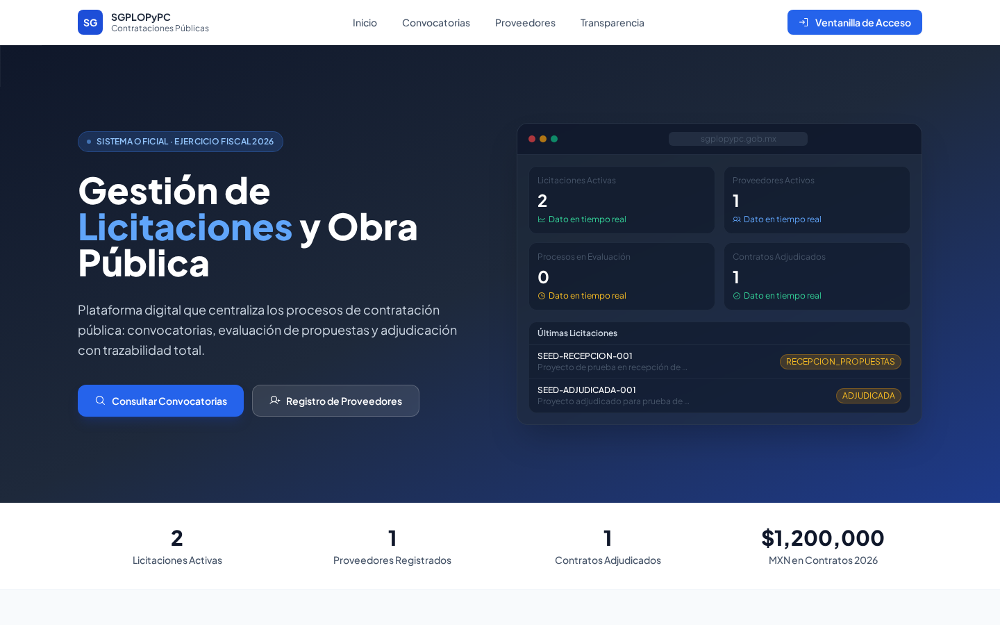
*Figura 5.1: Vista principal o Landing Page del sistema, accesible para cualquier usuario.*

### 5.2 Inicio de sesión
Para ingresar a su panel privado, realice los siguientes pasos:
1. En la parte superior derecha de la pantalla de inicio, haga clic en el botón **"Iniciar Sesión"**.
2. Escriba su correo electrónico y contraseña registrados.
3. Haga clic en **"Ingresar"**.

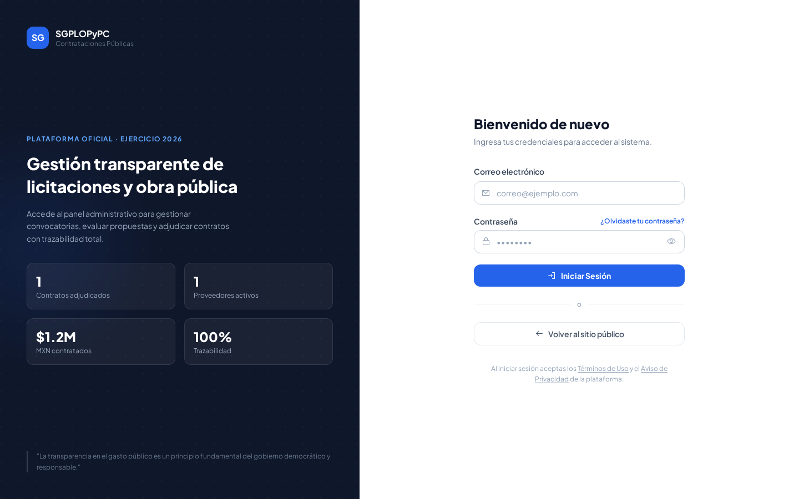
*Figura 5.2: Formulario de autenticación segura del sistema.*

---

## 6. Descripción general por rol
La plataforma adapta su interfaz y herramientas disponibles de acuerdo con el perfil del usuario autenticado.

| Permiso / Módulo | Público | Proveedor | Administrador |
| :--- | :---: | :---: | :---: |
| Consultar Convocatorias Activas | Sí | Sí | Sí |
| Descargar Documentos Públicos | Sí | Sí | Sí |
| Consultar Datos Abiertos (OCDS) | Sí | Sí | Sí |
| Marcar Favoritos | Sí | Sí | No aplica |
| Registrarse como Proveedor | Sí | No aplica | No aplica |
| Participar / Inscribirse en Licitaciones | No | Sí | No |
| Subir Propuestas (Técnica y Económica) | No | Sí | No |
| Gestionar Documentos de Empresa | No | Sí | No |
| Firmar Contratos (e.Firma) | No | Sí | Sí |
| Generar Reportes y Configuración | No | No | Sí |
| Emitir Dictámenes y Adjudicaciones | No | No | Sí |
| Auditar Operaciones | No | No | Sí |

---

## 7. Guía de uso para usuario público

El usuario con rol `PUBLICO` representa al ciudadano o a la contraloría social. Su enfoque principal es la consulta transparente y el control ciudadano.

### 7.1 Consultar Convocatorias y Resultados
1. Inicie sesión con la cuenta de público (`publico@demo.mx`).
2. Será redirigido al **Centro del Ciudadano**.
3. En esta pantalla se presenta un buscador general y filtros dinámicos por dependencia, tipo de licitación y estado.

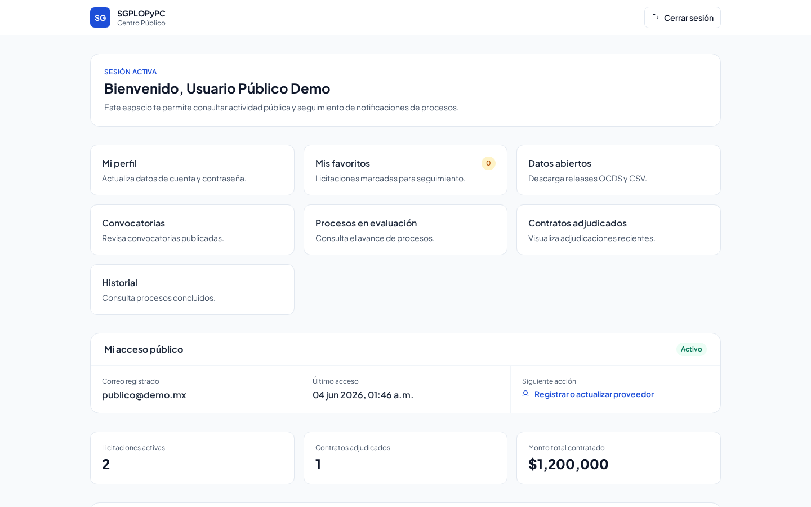
*Figura 7.1: Centro de control público con indicadores rápidos y barra de búsqueda.*

### 7.2 Datos Abiertos y Transparencia
El sistema cumple con el estándar internacional OCDS (Open Contracting Data Standard).
1. Acceda a la opción **"Datos Abiertos"** en el menú de navegación.
2. Podrá visualizar los flujos de contratación en formato estructurado JSON o realizar descargas masivas de paquetes de contratación (`release packages`) para auditoría pública.

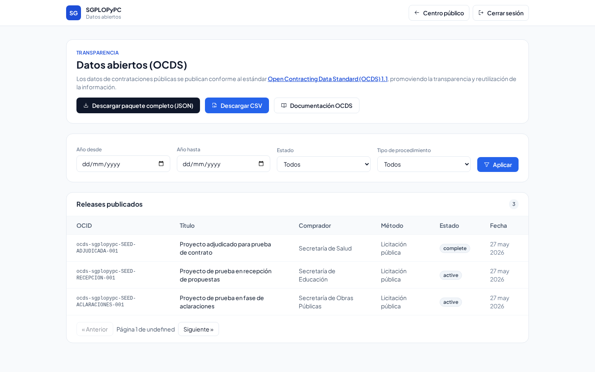
*Figura 7.2: Sección de visualización y descarga de Datos Abiertos (OCDS).*

### 7.3 Guardar Licitaciones Favoritas
Si existe un proceso de obra pública que desea seguir de cerca:
1. Navegue al detalle de la licitación de su interés.
2. Haga clic en el botón con forma de estrella **"Guardar en Favoritos"**.
3. Puede acceder a estas licitaciones directamente desde la pestaña **"Mis Favoritos"** en su menú lateral.

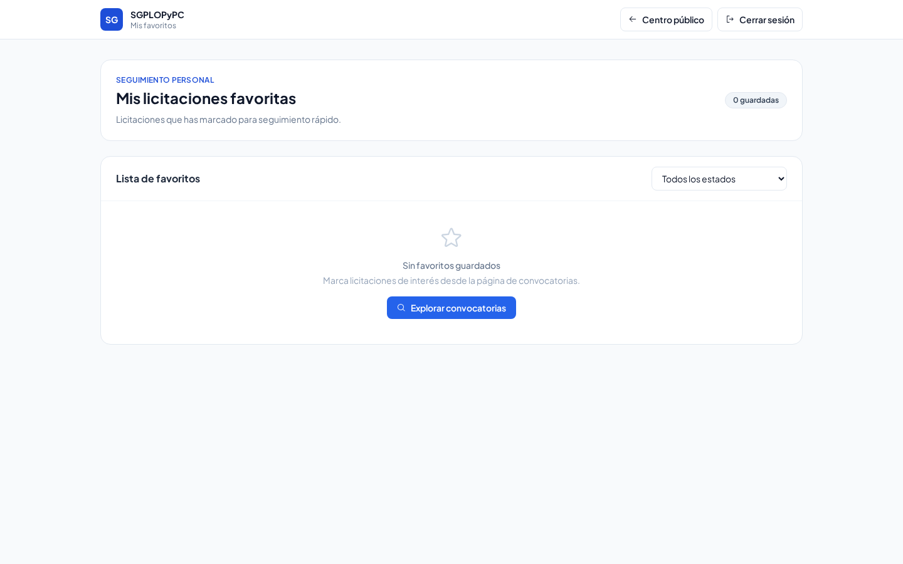
*Figura 7.3: Listado de convocatorias guardadas como favoritas por el ciudadano.*

---

## 8. Guía de uso para proveedor

El proveedor (`PROVEEDOR`) es el actor encargado de competir por las adjudicaciones de obra. Su panel es el más dinámico en cuanto a carga de información.

### 8.1 Centro de Control del Proveedor
Al iniciar sesión con su cuenta (`proveedor@demo.mx`), accederá al panel principal del proveedor. Aquí se muestran las estadísticas de su empresa:
* Participaciones totales.
* Propuestas enviadas y su tasa de éxito.
* Monto total propuesto y adjudicado.
* Contratos vigentes y notificaciones en tiempo real.

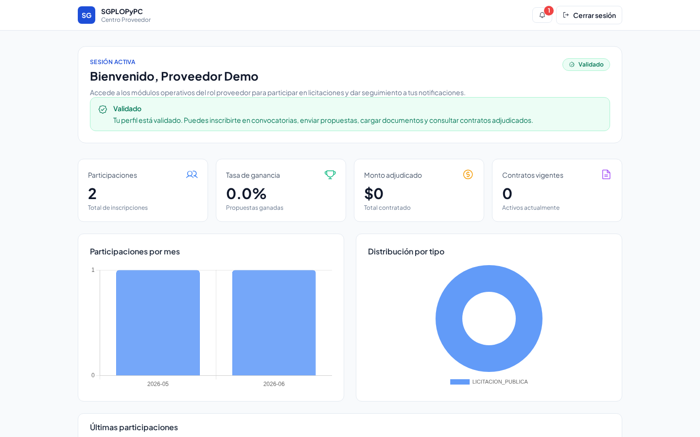
*Figura 8.1: Panel de Control del Proveedor con gráficos interactivos y KPIs.*

### 8.2 Consultar Convocatorias
Para explorar los concursos de obra pública vigentes:
1. Haga clic en **"Licitaciones"** o **"Convocatorias"** en el menú lateral.
2. Se desplegará el listado con información como la descripción de la obra, presupuesto base, fechas límite de inscripción y estado actual del proceso.

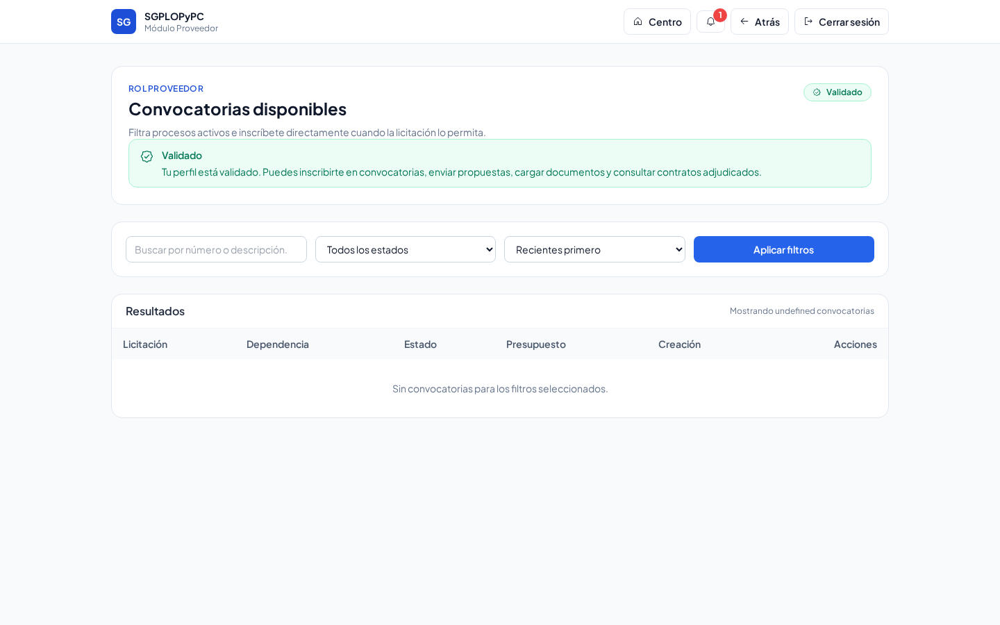
*Figura 8.2: Vista de convocatorias de licitación disponibles para inscripción.*

### 8.3 Inscribirse y Ver el Detalle de una Licitación
1. En el listado de convocatorias, haga clic en el botón **"Ver Detalle"** o haga clic sobre el título de la licitación.
2. Podrá consultar las bases técnicas completas, el calendario detallado de eventos (aclaraciones, presentación de propuestas, fallo) y descargar documentos adjuntos de la convocatoria.
3. Si cumple con los requisitos, haga clic en el botón **"Inscribirse en este Proceso"**. Su estado cambiará a "Inscrito".

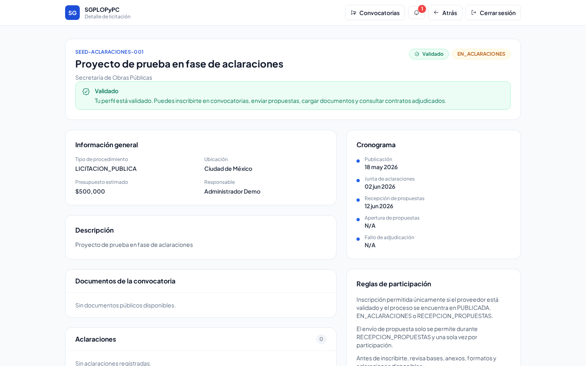
*Figura 8.3: Información detallada de una licitación seleccionada.*

### 8.4 Enviar y Consultar Participaciones
Una vez inscrito, puede dar seguimiento a sus participaciones en la pestaña **"Mis Participaciones"**:
1. Aquí se listan las obras en las que ha manifestado interés formal.
2. Desde aquí se gestiona la carga de la documentación legal para acreditar la personalidad de su empresa.

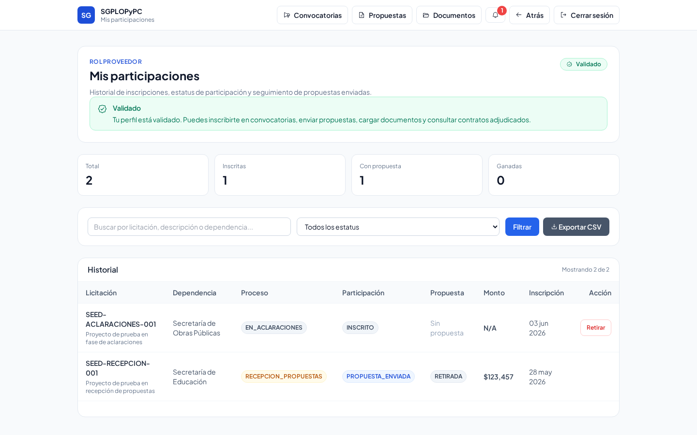
*Figura 8.4: Lista de licitaciones activas en las que el proveedor se encuentra inscrito.*

### 8.5 Presentar y Modificar Propuestas
1. Diríjase a **"Propuestas"** en el menú lateral.
2. Seleccione el proceso inscrito para el cual desea subir su propuesta.
3. Complete los datos requeridos: propuesta técnica y monto de la propuesta económica.
4. Adjunte los archivos PDF correspondientes.
5. Haga clic en **"Enviar Propuesta"**.
*Nota: Si el periodo de recepción de propuestas sigue abierto, podrá actualizarla o incluso hacer clic en "Retirar Propuesta" si decide no continuar.*

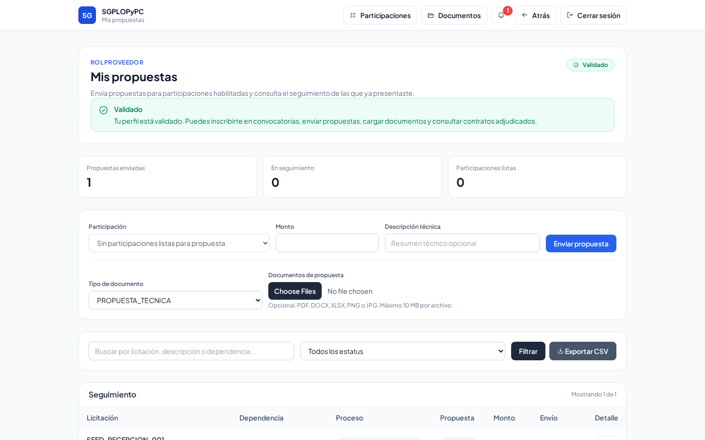
*Figura 8.5: Panel de envío de ofertas técnicas y económicas.*

### 8.6 Gestión de Expediente Digital (Documentos)
Para evitar subir repetidamente la misma información en cada licitación, use el repositorio de documentos:
1. Vaya a **"Mis Documentos"**.
2. Cargue sus archivos recurrentes (Acta Constitutiva, RFC, Opinión de Cumplimiento del SAT, Identificación Oficial, etc.).
3. El sistema los almacenará de manera segura en su expediente digital para que los asocie fácilmente a sus propuestas.

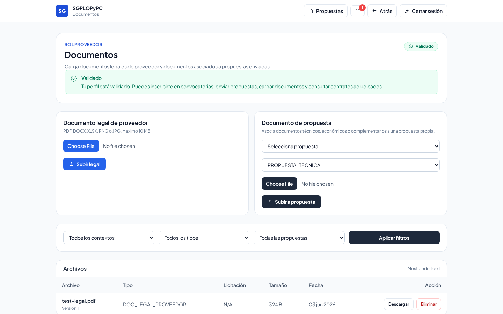
*Figura 8.6: Repositorio documental privado del proveedor.*

### 8.7 Firma y Seguimiento de Contratos
Cuando resulta ganador de una adjudicación, el contrato se genera automáticamente en la plataforma:
1. Acceda a la pestaña **"Contratos"**.
2. Seleccione el contrato pendiente de firma.
3. Revise las cláusulas técnicas y financieras del documento integrado.
4. Para realizar la firma digital segura: cargue sus llaves públicas/privadas de e.Firma (`.cer` y `.key`) junto con su contraseña de clave privada para estampar la firma electrónica oficial.

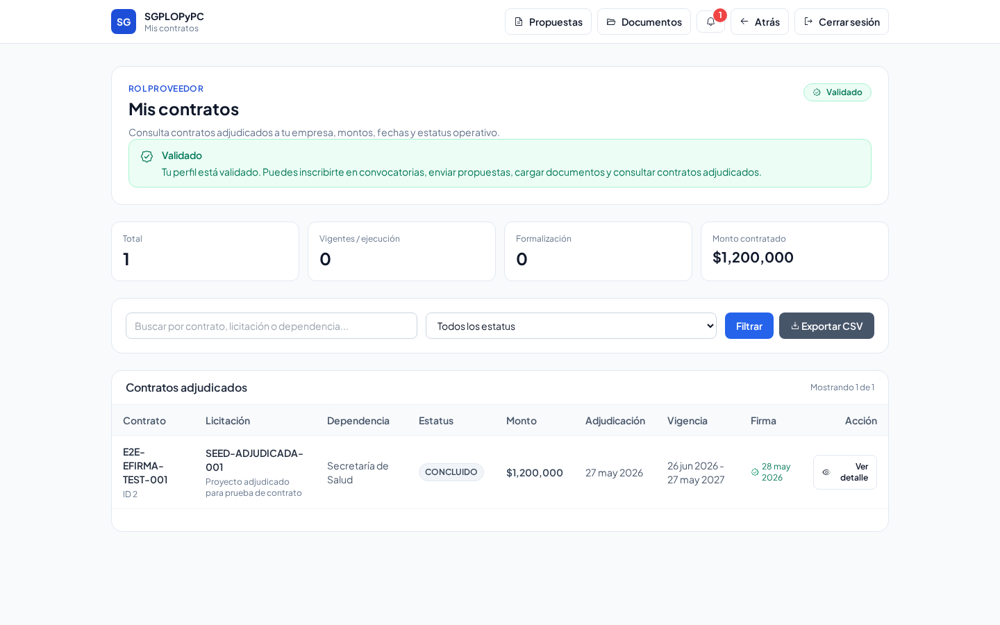
*Figura 8.7: Historial de contratos y estatus de formalización.*

### 8.8 Perfil del Proveedor
1. Ingrese a **"Mi Perfil"** en la barra lateral superior.
2. Mantenga actualizados los datos de contacto, RFC, dirección fiscal y representante legal de su empresa para evitar descalificaciones en los procesos.

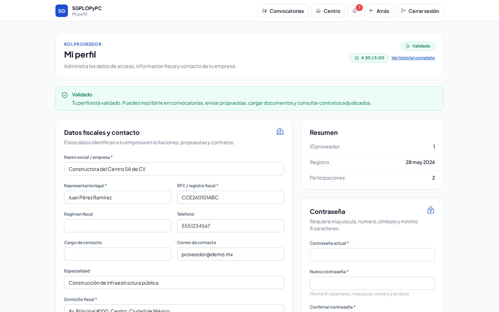
*Figura 8.8: Sección de datos generales y perfil legal del contratista.*

### 8.9 Buzón de Soporte y Tickets
Si experimenta problemas técnicos o dudas en las bases de licitación:
1. Acceda al módulo **"Soporte"**.
2. Haga clic en **"Nuevo Ticket"**.
3. Seleccione la categoría, describa el problema y envíelo. El personal administrador responderá su ticket directamente en la plataforma.

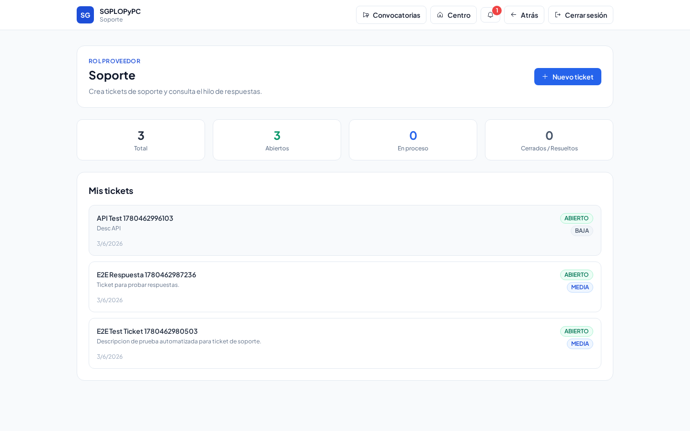
*Figura 8.9: Bandeja de mensajes y solicitudes de soporte técnico.*

### 8.10 Centro de Notificaciones (SSE)
La plataforma cuenta con un sistema de notificaciones en tiempo real basado en Server-Sent Events (SSE).
1. Al recibir una actualización (ej. un cambio de estado en una licitación, un mensaje de soporte o un nuevo contrato para firmar), un globo numérico aparecerá sobre el icono de campana.
2. Al dar clic, podrá visualizar y marcar como leídas las notificaciones urgentes.

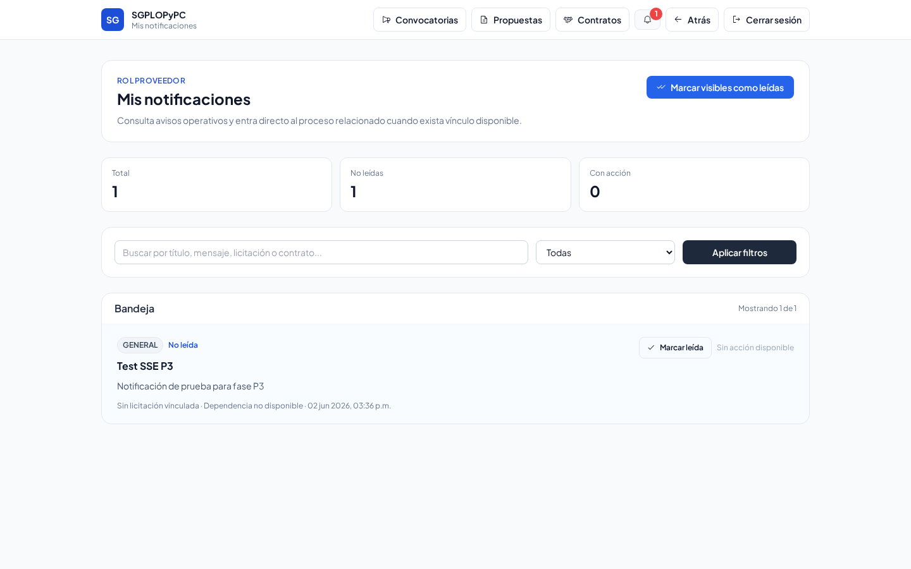
*Figura 8.10: Historial de avisos y notificaciones en tiempo real.*

---

## 9. Guía de uso para administrador

El usuario `ADMINISTRADOR` (`admin@sgplopypc.gob.mx`) tiene control total de la gestión administrativa y operativa de los procesos de contratación.

### 9.1 Dashboard Administrativo
Ofrece una perspectiva completa del sistema:
* Indicadores clave sobre montos totales contratados.
* Número de licitaciones organizadas por estado.
* Tiempos de ciclo promedio de contratación.
* Accesos rápidos a los expedientes de proveedores registrados para validación.

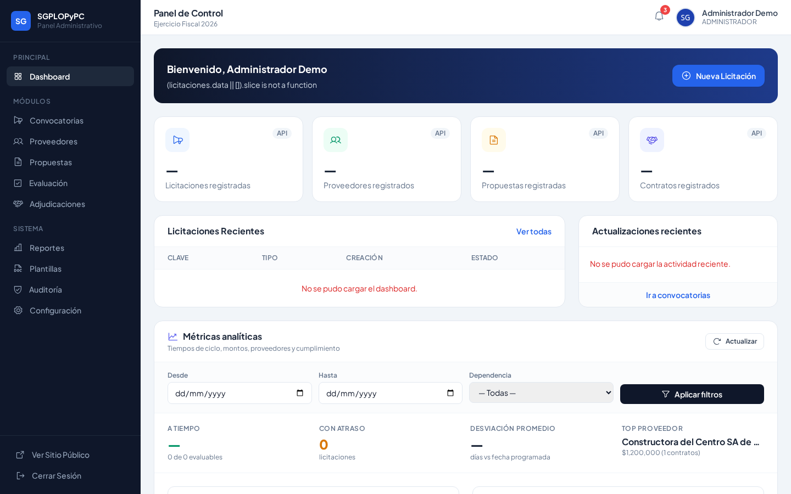
*Figura 9.1: Panel de Control del Administrador con gráficos globales e indicadores clave.*

### 9.2 Gestión y Creación de Convocatorias
1. Diríjase a **"Convocatorias"** y haga clic en **"Crear Convocatoria"**.
2. Introduzca el título de la obra, la dependencia solicitante, la descripción técnica detallada, el presupuesto estimado y configure el calendario del proceso (Fechas límite de aclaraciones, propuestas y fallo).
3. Guarde como Borrador o publique para que sea visible de inmediato al público y proveedores.

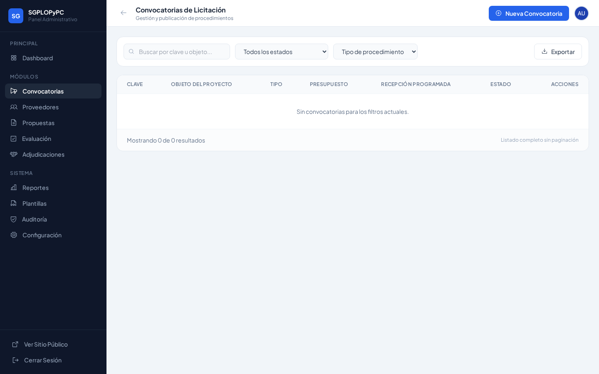
*Figura 9.2: Gestión y publicación de nuevas licitaciones públicas.*

### 9.3 Evaluaciones y Adjudicaciones
1. Cuando venza la fecha de entrega de propuestas, ingrese al módulo **"Evaluación"**.
2. Revise el expediente técnico y el monto económico de cada propuesta enviada por los proveedores inscritos.
3. Capture el puntaje obtenido por cada concursante de acuerdo con la matriz de evaluación y genere el dictamen técnico final.
4. El sistema declarará la propuesta ganadora para proceder con el fallo y generar el respectivo contrato de obra.

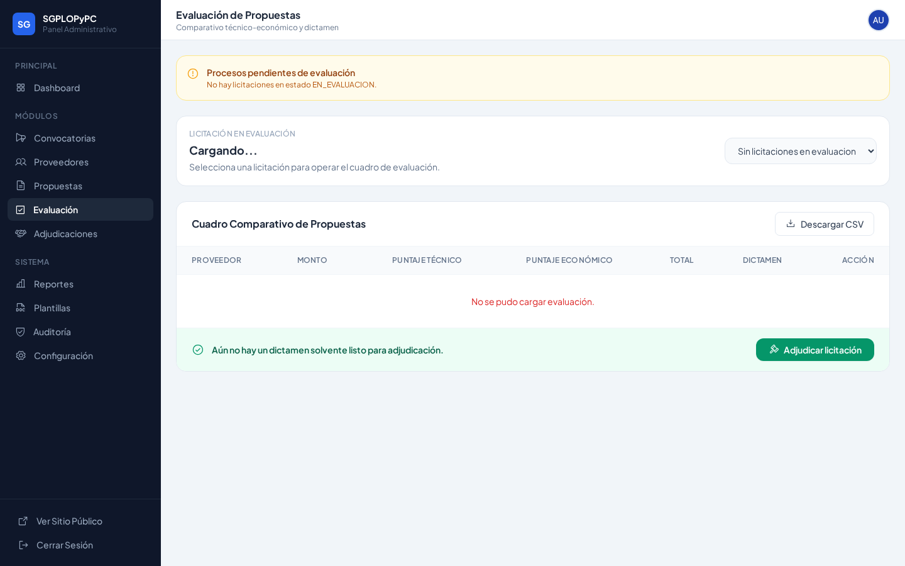
*Figura 9.3: Interfaz para la calificación y evaluación de ofertas de licitantes.*

---

## 10. Explicación de cada módulo visible para el usuario

### 10.1 Panel de Inicio / Landing
El punto de entrada del sistema. Permite a los usuarios no autenticados informarse sobre las normativas vigentes, descargar formatos generales y acceder al inicio de sesión o registro de nuevos proveedores.

### 10.2 Módulo de Registro de Proveedores
Permite a cualquier empresa interesada capturar su nombre/razón social, RFC, correo electrónico y contraseña inicial. Tras su aprobación por parte del administrador, se habilita su acceso como proveedor verificado.

### 10.3 Repositorio Documental
Funciona como una nube privada para los proveedores. Organiza la documentación por categorías (Legal, Financiera, Técnica). Cuenta con herramientas de carga de archivos de hasta 10 MB y previsualización de documentos cargados.

### 10.4 Módulo de Contratos y Firmas
Presenta un visor PDF de los contratos adjudicados. Los firmantes (Administrador y Representante del Proveedor) deben subir sus archivos criptográficos correspondientes a la e.Firma oficial mexicana para dar validez jurídica al acto.

### 10.5 Módulo de Notificaciones SSE
Un hilo persistente de comunicación que avisa instantáneamente sobre cambios de estado sin necesidad de refrescar la pantalla del navegador, lo cual evita pérdidas de fechas límite.

### 10.6 Panel de Control Administrativo y Configuración
Permite la administración de cuentas de usuario, asignación de roles, gestión de dependencias gubernamentales, personalización de plantillas de impresión en PDF/DOCX y auditoría completa del sistema.

---

## 11. Procedimientos paso a paso

### 11.1 Paso a paso: Inscribirse en una Licitación (Proveedor)
1. Inicie sesión en la plataforma como proveedor.
2. Vaya al menú **"Convocatorias"** y localice una licitación activa (con estado `PUBLICADA` o `EN_ACLARACIONES`).
3. Haga clic en **"Ver Detalle"**.
4. Revise las bases técnicas y fechas del calendario.
5. Si desea competir, haga clic en el botón verde **"Inscribirse en Licitación"**.
6. Recibirá una notificación emergente confirmando que su inscripción fue exitosa.

### 11.2 Paso a paso: Cargar y Presentar una Propuesta (Proveedor)
1. Inicie sesión y navegue al menú **"Propuestas"**.
2. Ubique la licitación en la que se inscribió previamente.
3. Haga clic en **"Enviar Propuesta"**.
4. Complete la información: describa brevemente la solución técnica propuesta e ingrese el precio total neto cotizado para la obra.
5. Cargue el archivo PDF de la propuesta técnica.
6. Cargue el archivo PDF de la propuesta económica.
7. Presione el botón **"Enviar Propuesta"**. El estatus cambiará a `ENVIADA`.

### 11.3 Paso a paso: Firmar un Contrato Adjudicado (Proveedor)
1. Diríjase a **"Mis Contratos"**.
2. Seleccione el contrato asignado que posea el estado `EN_PROCESO` de firma.
3. En la sección inferior de firma electrónica, arrastre o seleccione su certificado de e.Firma (`.cer`) y su clave privada (`.key`).
4. Introduzca la clave de acceso de su certificado.
5. Presione **"Firmar Digitalmente"**. El sistema validará con el SAT los certificados y cambiará el estado del contrato a `FIRMADO`.

### 11.4 Paso a paso: Crear y Publicar una Licitación (Administrador)
1. Como Administrador, ingrese a **"Convocatorias"** en su menú de control.
2. Haga clic en **"Nueva Convocatoria"**.
3. Rellene los campos obligatorios: Código de Licitación, Dependencia Solicitante, Título, Presupuesto Base y Descripción Técnica.
4. Asigne las fechas de inicio y cierre de cada etapa en el formulario de calendario.
5. Si desea que los proveedores la vean inmediatamente, seleccione el estado `PUBLICADA` y haga clic en **"Guardar"**.

---

## 12. Interpretación de estados, mensajes y notificaciones

### 12.1 Estados de las Licitaciones
Es fundamental conocer el significado de los estados del proceso para evitar quedar fuera de alguna fase:

| Estado | Significado | Acciones Permitidas |
| :--- | :--- | :--- |
| **BORRADOR** | La convocatoria está siendo diseñada por el administrador. | Edición de bases por el Administrador. Invisible para proveedores. |
| **PUBLICADA** | Convocatoria abierta y visible para el público. | Los proveedores pueden consultar detalles e inscribirse. |
| **EN_ACLARACIONES**| Periodo para que los proveedores envíen dudas sobre la obra. | Envío y respuesta de preguntas de aclaración. |
| **RECEPCION_PROPUESTAS** | Fase de recepción de ofertas técnicas y económicas. | Los proveedores inscritos cargan sus propuestas de obra. |
| **EN_EVALUACION** | La fecha límite concluyó. El comité técnico evalúa las ofertas.| El Administrador califica propuestas. No se aceptan nuevos envíos. |
| **ADJUDICADA** | Se emitió el fallo a favor de un proveedor ganador. | Visualización del acta de fallo. Inicio de generación de contrato. |
| **DESIERTA** | Ningún proveedor participó o ninguna oferta cumplió las bases. | El proceso concluye sin ganador. Requiere nueva convocatoria. |
| **CANCELADA** | El proceso fue suspendido definitivamente por la autoridad. | Ninguna acción permitida. Archivo del expediente. |

### 12.2 Estados de las Propuestas de Proveedores
* **ENVIADA:** Su propuesta fue cargada correctamente y está a la espera de la apertura de pliegos.
* **EN_EVALUACION:** El comité evaluador está revisando la documentación y asignando puntajes.
* **ACEPTADA:** La propuesta técnica y económica cumple con los requisitos del contrato.
* **RECHAZADA:** La propuesta no cumplió con las especificaciones técnicas o rebasó el presupuesto máximo.
* **RETIRADA:** El proveedor retiró voluntariamente su oferta antes de que concluyera el periodo de recepción.

---

## 13. Recomendaciones de uso

* **Respetar los tiempos del calendario:** El sistema cierra automáticamente la recepción de propuestas al llegar al segundo exacto configurado en el calendario. No se pueden otorgar prórrogas manuales una vez vencido el plazo.
* **Tamaño y formato de archivos:** Procure que todos los documentos PDF subidos estén debidamente optimizados. El sistema rechaza archivos individuales que superen los **10 MB**.
* **Mantener a salvo las llaves de la e.Firma:** Recuerde que la e.Firma tiene el mismo valor legal que una firma autógrafa. Nunca comparta sus archivos `.key` y contraseñas con terceros no autorizados.
* **Cerrar sesión al terminar:** Si utiliza un equipo de uso compartido, haga clic en el botón de cerrar sesión ubicado en la esquina superior derecha para prevenir accesos no autorizados a su cuenta empresarial.

---

## 14. Problemas frecuentes y solución básica

### 14.1 Problema: Credenciales Inválidas
* **Causa posible:** Escribió incorrectamente su correo electrónico o su contraseña, o el administrador aún no aprueba su registro.
* **Solución:** Verifique el uso de mayúsculas/minúsculas. Si olvidó su acceso, utilice el enlace "Olvidé mi contraseña" en la pantalla de login para recibir un token de restablecimiento.

### 14.2 Problema: Error de Carga al Subir Documento
* **Causa posible:** El archivo excede el tamaño máximo de 10 MB, o no se encuentra en el formato de extensión permitido (PDF, DOCX, XLSX, JPG, PNG).
* **Solución:** Comprima el archivo PDF para reducir su peso y compruebe que la extensión del archivo sea la correcta antes de intentar la carga.

### 14.3 Problema: No puedo inscribirme a una Licitación
* **Causa posible:** El estado de la licitación no es `PUBLICADA` o `EN_ACLARACIONES` (por ejemplo, ya cambió a recepción de propuestas o evaluación), o su perfil de proveedor está desactivado por un administrador.
* **Solución:** Revise el cronograma de fechas de la licitación. Si la fecha aún es válida, envíe un ticket de soporte para comprobar el estatus legal de su cuenta de proveedor.

---

## 15. Glosario breve

* **Adjudicación:** Acto administrativo mediante el cual se asigna formalmente la ejecución de la obra pública al licitante ganador.
* **Bases de Licitación:** Documentos que contienen los requisitos legales, técnicos, económicos y los lineamientos del procedimiento de contratación.
* **e.Firma:** Firma electrónica avanzada basada en certificados digitales emitidos por el Servicio de Administración Tributaria (SAT).
* **Fallo:** Dictamen oficial en el cual la dependencia convocante declara al proveedor seleccionado para la realización de la obra pública.
* **OCDS (Open Contracting Data Standard):** Estándar de datos abiertos que define cómo publicar datos y documentos sobre todas las etapas de la contratación pública.
* **SSE (Server-Sent Events):** Tecnología web que permite al servidor enviar notificaciones y actualizaciones de forma instantánea al navegador del usuario sin necesidad de refrescar la pantalla.

---

## 16. Anexos con capturas de pantalla

Esta sección compila de forma consecutiva las capturas de la plataforma tomadas en tiempo real para facilitar su identificación visual:

### Anexo A: Pantalla de Entrada General (Landing Page)

*Vista de bienvenida, búsqueda general y enlaces a la transparencia de convocatorias.*

### Anexo B: Formulario de Inicio de Sesión (Login)

*Acceso seguro por correo electrónico y credenciales con validación activa.*

### Anexo C: Panel de Control del Proveedor (Dashboard)

*Estadísticas, tasas de éxito en licitaciones y listados dinámicos.*

### Anexo D: Listado de Licitaciones y Convocatorias

*Listado con filtros y buscadores dinámicos para localización de proyectos de obra.*

### Anexo E: Ficha Detallada de la Licitación

*Calendario, bases, documentos oficiales adjuntos y botones de inscripción.*

### Anexo F: Mis Participaciones

*Seguimiento del estatus del proveedor dentro de los procesos de licitación en curso.*

### Anexo G: Carga de Propuesta Técnica y Económica

*Formulario de montos y carga de archivos en PDF para la evaluación técnica.*

### Anexo H: Expediente Digital de Documentos

*Nube de almacenamiento para actas, RFC, y acreditaciones legales.*

### Anexo I: Control de Contratos Adjudicados

*Visualización de contratos en proceso, firmados o ejecutados con firmas estampadas.*

### Anexo J: Mi Perfil del Proveedor

*Configuración de datos legales y de contacto del contratista.*

### Anexo K: Centro de Notificaciones en Tiempo Real

*Historial de avisos y alertas rápidas sobre las licitaciones participantes.*

### Anexo L: Tickets de Soporte Técnico

*Generación de dudas y aclaraciones operativas directamente con el administrador.*

### Anexo M: Panel de Control del Administrador

*Métricas globales de montos mensuales, estado de convocatorias y accesos rápidos.*

### Anexo N: Administración de Licitaciones y Convocatorias

*Pantalla de administración para la publicación y edición de licitaciones oficiales.*

### Anexo O: Calificación de Ofertas (Evaluaciones)

*Asignación de puntajes técnicos y formulación de dictámenes por parte del administrador.*

### Anexo P: Panel del Ciudadano (Usuario Público)

*Vista simplificada con acceso a contratos públicos y obras de su interés.*

### Anexo Q: Portal de Datos Abiertos (OCDS)

*Repositorio de paquetes de información de contrataciones públicas bajo el estándar internacional.*

### Anexo R: Licitaciones Favoritas Ciudadanas

*Bandeja de seguimiento rápido para proyectos específicos que interesan a la ciudadanía.*
