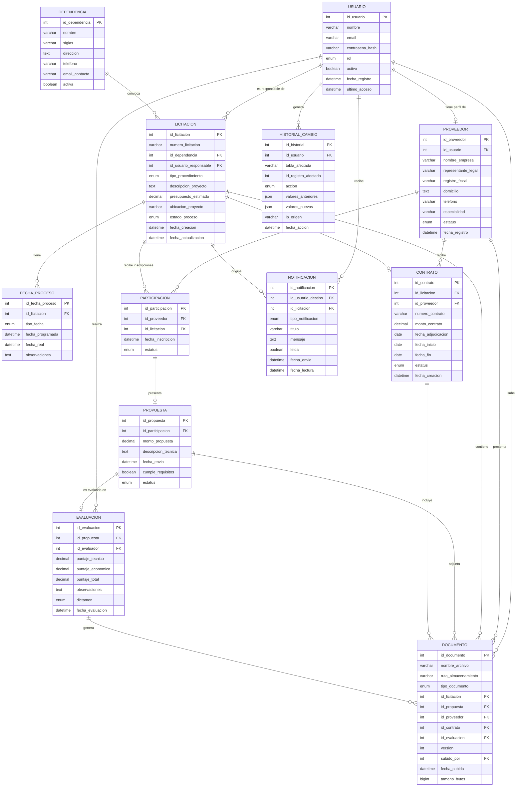
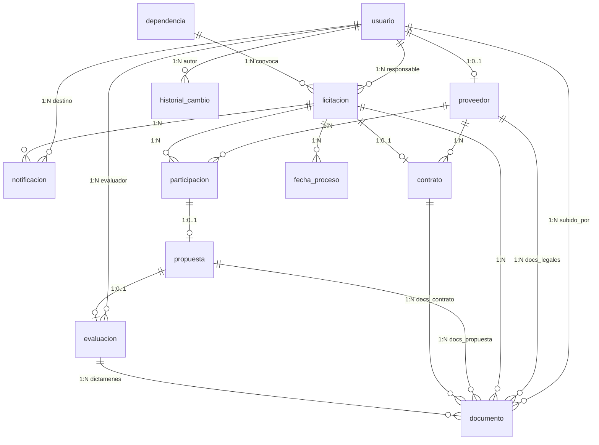

# Modelado de Base de Datos — SGPLOPyPC

## Sistema para la Gestión del Procedimiento de Licitación de Obra Pública y Procesos de Contratación

---

## Tabla de Contenido

1. [Análisis del Documento](#1-análisis-del-documento)
2. [Identificación de Entidades](#2-identificación-de-entidades)
3. [Diccionario de Datos](#3-diccionario-de-datos)
4. [Modelo Entidad-Relación (E-R)](#4-modelo-entidad-relación-e-r)
5. [Cardinalidad de las Relaciones](#5-cardinalidad-de-las-relaciones)
6. [Modelo Relacional](#6-modelo-relacional)
7. [Diagrama Relacional (Tablas)](#7-diagrama-relacional-tablas)
8. [Restricciones e Integridad](#8-restricciones-e-integridad)
9. [Justificación de Decisiones de Diseño](#9-justificación-de-decisiones-de-diseño)

---

## 1. Análisis del Documento

### 1.1 Resumen de Requerimientos

El sistema requiere gestionar el ciclo de vida completo de una licitación de obra pública:

1. **Registro y publicación** de convocatorias/licitaciones.
2. **Registro de proveedores** con su información empresarial y documental.
3. **Recepción de propuestas** técnicas y económicas por parte de proveedores.
4. **Evaluación de propuestas** por un comité evaluador.
5. **Adjudicación y contratación** del proveedor ganador.
6. **Auditoría y trazabilidad** de todas las acciones del sistema.
7. **Notificaciones** automáticas a los participantes.
8. **Gestión documental** transversal a todo el proceso.
9. **Reportes y estadísticas**.

### 1.2 Roles de Usuario Identificados

| Rol | Código | Descripción |
|-----|--------|-------------|
| Público / Visitante | `PUBLICO` | Solo consulta. No requiere registro. |
| Proveedor / Contratista | `PROVEEDOR` | Se registra, participa en licitaciones, sube propuestas. |
| Administrador / Responsable | `ADMINISTRADOR` | Gestiona licitaciones, evalúa, adjudica, genera reportes. |

### 1.3 Entidades Sugeridas por el Documento vs. Entidades Finales

El documento sugiere 8 entidades base. Tras el análisis detallado de todos los módulos y requerimientos, se identificaron **12 entidades** necesarias para cubrir la totalidad de la funcionalidad sin necesidad de agregar tablas durante el desarrollo.

**Entidades adicionales identificadas:**

- **Dependencia**: El documento menciona "dependencia convocante" como atributo de licitación, pero dado que múltiples licitaciones pueden pertenecer a la misma dependencia y se necesita consistencia referencial, amerita una entidad propia.
- **Fecha de Proceso**: Cada licitación tiene múltiples fechas clave con significado distinto. Una entidad dedicada permite flexibilidad y evita columnas nulas.
- **Participación**: Relación entre proveedor y licitación. No es lo mismo que propuesta (un proveedor puede inscribirse pero no presentar propuesta). Controla el historial de participación mencionado en el módulo de proveedores.
- **Notificación**: El sistema debe enviar notificaciones automáticas a proveedores (resultados, aclaraciones, cambios). Requiere persistencia en base de datos.

---

## 2. Identificación de Entidades

| # | Entidad | Propósito |
|---|---------|-----------|
| 1 | `usuario` | Credenciales, datos personales y rol de acceso al sistema |
| 2 | `dependencia` | Organismo o dependencia gubernamental que convoca licitaciones |
| 3 | `proveedor` | Empresa o contratista registrado para participar en licitaciones |
| 4 | `licitacion` | Proceso de contratación con toda su información general |
| 5 | `fecha_proceso` | Fechas clave del cronograma de cada licitación |
| 6 | `documento` | Archivos asociados a licitaciones, propuestas, contratos o proveedores |
| 7 | `participacion` | Inscripción de un proveedor en una licitación |
| 8 | `propuesta` | Oferta técnica y/o económica presentada por un proveedor |
| 9 | `evaluacion` | Resultado de la evaluación de una propuesta por el comité |
| 10 | `contrato` | Contrato formalizado tras la adjudicación |
| 11 | `notificacion` | Avisos y alertas enviadas a usuarios del sistema |
| 12 | `historial_cambio` | Registro de auditoría de todas las acciones en el sistema |

---

## 3. Diccionario de Datos

### 3.1 `usuario`

| Atributo | Tipo | Nulo | Descripción |
|----------|------|------|-------------|
| `id_usuario` | INT (PK) | NO | Identificador único |
| `nombre` | VARCHAR(150) | NO | Nombre completo |
| `email` | VARCHAR(200) | NO | Correo electrónico (único) |
| `contrasena_hash` | VARCHAR(255) | NO | Hash de la contraseña |
| `rol` | ENUM('PUBLICO','PROVEEDOR','ADMINISTRADOR') | NO | Rol del usuario en el sistema |
| `activo` | BOOLEAN | NO | Indica si la cuenta está activa |
| `fecha_registro` | DATETIME | NO | Fecha y hora de creación de la cuenta |
| `ultimo_acceso` | DATETIME | SÍ | Fecha y hora del último inicio de sesión |

### 3.2 `dependencia`

| Atributo | Tipo | Nulo | Descripción |
|----------|------|------|-------------|
| `id_dependencia` | INT (PK) | NO | Identificador único |
| `nombre` | VARCHAR(250) | NO | Nombre de la dependencia gubernamental |
| `siglas` | VARCHAR(20) | SÍ | Siglas o acrónimo |
| `direccion` | TEXT | SÍ | Dirección física |
| `telefono` | VARCHAR(20) | SÍ | Teléfono de contacto |
| `email_contacto` | VARCHAR(200) | SÍ | Correo electrónico institucional |
| `activa` | BOOLEAN | NO | Indica si la dependencia está activa |

### 3.3 `proveedor`

| Atributo | Tipo | Nulo | Descripción |
|----------|------|------|-------------|
| `id_proveedor` | INT (PK) | NO | Identificador único |
| `id_usuario` | INT (FK → usuario) | NO | Usuario asociado a este proveedor |
| `nombre_empresa` | VARCHAR(250) | NO | Razón social de la empresa |
| `representante_legal` | VARCHAR(200) | NO | Nombre del representante legal |
| `registro_fiscal` | VARCHAR(20) | NO | RFC o registro fiscal (único) |
| `domicilio` | TEXT | NO | Dirección fiscal |
| `telefono` | VARCHAR(20) | SÍ | Teléfono de la empresa |
| `especialidad` | VARCHAR(300) | SÍ | Especialidad en obra o servicios |
| `estatus` | ENUM('PENDIENTE','VALIDADO','RECHAZADO','SUSPENDIDO') | NO | Estado de validación del proveedor |
| `fecha_registro` | DATETIME | NO | Fecha de registro en el sistema |

### 3.4 `licitacion`

| Atributo | Tipo | Nulo | Descripción |
|----------|------|------|-------------|
| `id_licitacion` | INT (PK) | NO | Identificador único |
| `numero_licitacion` | VARCHAR(50) | NO | Número o clave oficial de la licitación (único) |
| `id_dependencia` | INT (FK → dependencia) | NO | Dependencia convocante |
| `id_usuario_responsable` | INT (FK → usuario) | NO | Administrador responsable del proceso |
| `tipo_procedimiento` | ENUM('LICITACION_PUBLICA','INVITACION_RESTRINGIDA','ADJUDICACION_DIRECTA') | NO | Tipo de procedimiento de contratación |
| `descripcion_proyecto` | TEXT | NO | Descripción del proyecto de obra pública |
| `presupuesto_estimado` | DECIMAL(18,2) | NO | Presupuesto estimado del proyecto |
| `ubicacion_proyecto` | VARCHAR(500) | SÍ | Ubicación geográfica del proyecto |
| `estado_proceso` | ENUM('BORRADOR','PUBLICADA','EN_ACLARACIONES','RECEPCION_PROPUESTAS','EN_EVALUACION','ADJUDICADA','DESIERTA','CANCELADA') | NO | Estado actual del proceso |
| `fecha_creacion` | DATETIME | NO | Fecha de creación del registro |
| `fecha_actualizacion` | DATETIME | NO | Última modificación del registro |

### 3.5 `fecha_proceso`

| Atributo | Tipo | Nulo | Descripción |
|----------|------|------|-------------|
| `id_fecha_proceso` | INT (PK) | NO | Identificador único |
| `id_licitacion` | INT (FK → licitacion) | NO | Licitación asociada |
| `tipo_fecha` | ENUM('PUBLICACION_CONVOCATORIA','JUNTA_ACLARACIONES','RECEPCION_PROPUESTAS','APERTURA_PROPUESTAS','FALLO_ADJUDICACION') | NO | Tipo de fecha en el proceso |
| `fecha_programada` | DATETIME | NO | Fecha y hora programada |
| `fecha_real` | DATETIME | SÍ | Fecha y hora en que realmente ocurrió |
| `observaciones` | TEXT | SÍ | Notas sobre cambios o aclaraciones |

**Restricción de unicidad compuesta:** (`id_licitacion`, `tipo_fecha`) — cada licitación tiene solo una fecha por tipo.

### 3.6 `documento`

| Atributo | Tipo | Nulo | Descripción |
|----------|------|------|-------------|
| `id_documento` | INT (PK) | NO | Identificador único |
| `nombre_archivo` | VARCHAR(300) | NO | Nombre del archivo |
| `ruta_almacenamiento` | VARCHAR(500) | NO | Ruta física o URL del archivo |
| `tipo_documento` | ENUM('BASES_LICITACION','ANEXO_TECNICO','PLANO','FORMATO_OFICIAL','ACTA_PROCESO','PROPUESTA_TECNICA','PROPUESTA_ECONOMICA','DOC_COMPLEMENTARIA','DOC_LEGAL_PROVEEDOR','DOC_CONTRATO','ACLARACION','DICTAMEN') | NO | Clasificación del documento |
| `id_licitacion` | INT (FK → licitacion) | SÍ | Licitación asociada (si aplica) |
| `id_propuesta` | INT (FK → propuesta) | SÍ | Propuesta asociada (si aplica) |
| `id_proveedor` | INT (FK → proveedor) | SÍ | Proveedor asociado (si aplica) |
| `id_contrato` | INT (FK → contrato) | SÍ | Contrato asociado (si aplica) |
| `id_evaluacion` | INT (FK → evaluacion) | SÍ | Evaluación asociada (si aplica) |
| `version` | INT | NO | Número de versión del documento (control de versiones) |
| `subido_por` | INT (FK → usuario) | NO | Usuario que subió el documento |
| `fecha_subida` | DATETIME | NO | Fecha y hora de carga |
| `tamano_bytes` | BIGINT | SÍ | Tamaño del archivo en bytes |

**Nota:** Se usa una sola tabla de documentos con múltiples FKs opcionales (patrón polimórfico por FK). Al menos una de las FKs (`id_licitacion`, `id_propuesta`, `id_proveedor`, `id_contrato`, `id_evaluacion`) debe tener valor. Esto se validará con un CHECK constraint.

### 3.7 `participacion`

| Atributo | Tipo | Nulo | Descripción |
|----------|------|------|-------------|
| `id_participacion` | INT (PK) | NO | Identificador único |
| `id_proveedor` | INT (FK → proveedor) | NO | Proveedor inscrito |
| `id_licitacion` | INT (FK → licitacion) | NO | Licitación en la que participa |
| `fecha_inscripcion` | DATETIME | NO | Fecha de inscripción a la licitación |
| `estatus` | ENUM('INSCRITO','PROPUESTA_ENVIADA','DESCALIFICADO','GANADOR','NO_GANADOR') | NO | Estado de la participación |

**Restricción de unicidad compuesta:** (`id_proveedor`, `id_licitacion`) — un proveedor se inscribe una sola vez por licitación.

### 3.8 `propuesta`

| Atributo | Tipo | Nulo | Descripción |
|----------|------|------|-------------|
| `id_propuesta` | INT (PK) | NO | Identificador único |
| `id_participacion` | INT (FK → participacion) | NO | Participación a la que pertenece esta propuesta |
| `monto_propuesta` | DECIMAL(18,2) | SÍ | Monto de la propuesta económica |
| `descripcion_tecnica` | TEXT | SÍ | Resumen de la propuesta técnica |
| `fecha_envio` | DATETIME | NO | Fecha y hora de envío |
| `cumple_requisitos` | BOOLEAN | SÍ | Indica si cumple los requisitos obligatorios (validación) |
| `estatus` | ENUM('RECIBIDA','EN_REVISION','ACEPTADA','RECHAZADA') | NO | Estado de la propuesta |

### 3.9 `evaluacion`

| Atributo | Tipo | Nulo | Descripción |
|----------|------|------|-------------|
| `id_evaluacion` | INT (PK) | NO | Identificador único |
| `id_propuesta` | INT (FK → propuesta) | NO | Propuesta evaluada |
| `id_evaluador` | INT (FK → usuario) | NO | Usuario administrador que evalúa |
| `puntaje_tecnico` | DECIMAL(5,2) | SÍ | Puntuación técnica |
| `puntaje_economico` | DECIMAL(5,2) | SÍ | Puntuación económica |
| `puntaje_total` | DECIMAL(5,2) | SÍ | Puntuación total calculada |
| `observaciones` | TEXT | SÍ | Observaciones del comité evaluador |
| `dictamen` | ENUM('SOLVENTE','NO_SOLVENTE','DESCALIFICADA') | SÍ | Resultado del dictamen |
| `fecha_evaluacion` | DATETIME | NO | Fecha y hora de la evaluación |

### 3.10 `contrato`

| Atributo | Tipo | Nulo | Descripción |
|----------|------|------|-------------|
| `id_contrato` | INT (PK) | NO | Identificador único |
| `id_licitacion` | INT (FK → licitacion) | NO | Licitación que origina el contrato |
| `id_proveedor` | INT (FK → proveedor) | NO | Proveedor adjudicado |
| `numero_contrato` | VARCHAR(50) | NO | Número oficial del contrato (único) |
| `monto_contrato` | DECIMAL(18,2) | NO | Monto total del contrato |
| `fecha_adjudicacion` | DATE | NO | Fecha del fallo de adjudicación |
| `fecha_inicio` | DATE | SÍ | Fecha de inicio de la obra/servicio |
| `fecha_fin` | DATE | SÍ | Fecha estimada de conclusión |
| `estatus` | ENUM('EN_FORMALIZACION','VIGENTE','EN_EJECUCION','CONCLUIDO','RESCINDIDO') | NO | Estado del contrato |
| `fecha_creacion` | DATETIME | NO | Fecha de registro en el sistema |

### 3.11 `notificacion`

| Atributo | Tipo | Nulo | Descripción |
|----------|------|------|-------------|
| `id_notificacion` | INT (PK) | NO | Identificador único |
| `id_usuario_destino` | INT (FK → usuario) | NO | Usuario destinatario |
| `id_licitacion` | INT (FK → licitacion) | SÍ | Licitación relacionada (si aplica) |
| `tipo_notificacion` | ENUM('CONVOCATORIA_PUBLICADA','ACLARACION','RESULTADO_EVALUACION','ADJUDICACION','CAMBIO_ESTADO','GENERAL') | NO | Tipo de notificación |
| `titulo` | VARCHAR(300) | NO | Título de la notificación |
| `mensaje` | TEXT | NO | Contenido del mensaje |
| `leida` | BOOLEAN | NO | Indica si fue leída |
| `fecha_envio` | DATETIME | NO | Fecha y hora de envío |
| `fecha_lectura` | DATETIME | SÍ | Fecha y hora en que se leyó |

### 3.12 `historial_cambio`

| Atributo | Tipo | Nulo | Descripción |
|----------|------|------|-------------|
| `id_historial` | INT (PK) | NO | Identificador único |
| `id_usuario` | INT (FK → usuario) | NO | Usuario que realizó la acción |
| `tabla_afectada` | VARCHAR(50) | NO | Nombre de la tabla donde ocurrió el cambio |
| `id_registro_afectado` | INT | NO | ID del registro afectado |
| `accion` | ENUM('CREAR','ACTUALIZAR','ELIMINAR') | NO | Tipo de acción |
| `valores_anteriores` | JSON | SÍ | Snapshot de los valores antes del cambio |
| `valores_nuevos` | JSON | SÍ | Snapshot de los valores después del cambio |
| `ip_origen` | VARCHAR(45) | SÍ | Dirección IP desde donde se ejecutó la acción |
| `fecha_accion` | DATETIME | NO | Fecha y hora de la acción |

---

## 4. Modelo Entidad-Relación (E-R)

### 4.1 Diagrama E-R



---

## 5. Cardinalidad de las Relaciones

| # | Relación | Cardinalidad | Descripción |
|---|----------|-------------|-------------|
| 1 | `usuario` → `proveedor` | **1:0..1** | Un usuario puede tener cero o un perfil de proveedor. Un proveedor pertenece a exactamente un usuario. |
| 2 | `usuario` → `licitacion` | **1:0..N** | Un administrador puede ser responsable de cero o muchas licitaciones. Cada licitación tiene exactamente un responsable. |
| 3 | `usuario` → `evaluacion` | **1:0..N** | Un evaluador puede realizar cero o muchas evaluaciones. Cada evaluación pertenece a un evaluador. |
| 4 | `usuario` → `notificacion` | **1:0..N** | Un usuario puede recibir cero o muchas notificaciones. Cada notificación tiene un único destinatario. |
| 5 | `usuario` → `historial_cambio` | **1:0..N** | Un usuario puede generar cero o muchos registros de auditoría. Cada registro pertenece a un usuario. |
| 6 | `usuario` → `documento` | **1:0..N** | Un usuario puede subir cero o muchos documentos. Cada documento tiene un único responsable de carga. |
| 7 | `dependencia` → `licitacion` | **1:0..N** | Una dependencia puede convocar cero o muchas licitaciones. Cada licitación pertenece a una dependencia. |
| 8 | `proveedor` → `participacion` | **1:0..N** | Un proveedor puede inscribirse en cero o muchas licitaciones. Cada inscripción corresponde a un proveedor. |
| 9 | `proveedor` → `contrato` | **1:0..N** | Un proveedor puede tener cero o muchos contratos. Cada contrato corresponde a un proveedor. |
| 10 | `proveedor` → `documento` | **1:0..N** | Un proveedor puede tener cero o muchos documentos legales/técnicos asociados. |
| 11 | `licitacion` → `fecha_proceso` | **1:0..N** | Una licitación tiene hasta 5 fechas de proceso. Cada fecha pertenece a una licitación. |
| 12 | `licitacion` → `participacion` | **1:0..N** | Una licitación puede tener cero o muchos proveedores inscritos. |
| 13 | `licitacion` → `documento` | **1:0..N** | Una licitación puede tener cero o muchos documentos asociados. |
| 14 | `licitacion` → `contrato` | **1:0..1** | Una licitación genera cero o un contrato (puede quedar desierta). |
| 15 | `licitacion` → `notificacion` | **1:0..N** | Una licitación puede originar cero o muchas notificaciones. |
| 16 | `participacion` → `propuesta` | **1:0..1** | Una participación genera cero o una propuesta. Cada propuesta pertenece a una participación. |
| 17 | `propuesta` → `evaluacion` | **1:0..1** | Una propuesta puede tener cero o una evaluación. Cada evaluación pertenece a una propuesta. |
| 18 | `propuesta` → `documento` | **1:0..N** | Una propuesta puede tener cero o muchos documentos adjuntos. |
| 19 | `contrato` → `documento` | **1:0..N** | Un contrato puede tener cero o muchos documentos asociados. |
| 20 | `evaluacion` → `documento` | **1:0..N** | Una evaluación puede generar cero o muchos documentos (dictámenes). |

### 5.1 Diagrama de Cardinalidad Simplificado

```
DEPENDENCIA (1) ──────────────< (N) LICITACION
USUARIO (1) ──────────────────< (N) LICITACION         [responsable]
USUARIO (1) ──────────────────< (0..1) PROVEEDOR
USUARIO (1) ──────────────────< (N) EVALUACION          [evaluador]
USUARIO (1) ──────────────────< (N) NOTIFICACION        [destino]
USUARIO (1) ──────────────────< (N) HISTORIAL_CAMBIO
USUARIO (1) ──────────────────< (N) DOCUMENTO            [subido_por]
PROVEEDOR (1) ────────────────< (N) PARTICIPACION
LICITACION (1) ───────────────< (N) PARTICIPACION
LICITACION (1) ───────────────< (N) FECHA_PROCESO
LICITACION (1) ───────────────< (0..1) CONTRATO
LICITACION (1) ───────────────< (N) NOTIFICACION
PARTICIPACION (1) ────────────< (0..1) PROPUESTA
PROPUESTA (1) ────────────────< (0..1) EVALUACION
PROVEEDOR (1) ────────────────< (N) CONTRATO
LICITACION/PROPUESTA/PROVEEDOR/CONTRATO/EVALUACION (1) ──< (N) DOCUMENTO
```

---

## 6. Modelo Relacional

A continuación se presenta el esquema relacional formal con claves primarias (PK), claves foráneas (FK) y restricciones.

### Notación

- **PK** = Primary Key
- **FK** = Foreign Key
- **UQ** = Unique
- **NN** = Not Null
- **CK** = Check Constraint

```
usuario (
    id_usuario      INT         PK,
    nombre          VARCHAR(150) NN,
    email           VARCHAR(200) NN UQ,
    contrasena_hash VARCHAR(255) NN,
    rol             ENUM('PUBLICO','PROVEEDOR','ADMINISTRADOR') NN,
    activo          BOOLEAN     NN DEFAULT TRUE,
    fecha_registro  DATETIME    NN,
    ultimo_acceso   DATETIME
)

dependencia (
    id_dependencia  INT         PK,
    nombre          VARCHAR(250) NN,
    siglas          VARCHAR(20),
    direccion       TEXT,
    telefono        VARCHAR(20),
    email_contacto  VARCHAR(200),
    activa          BOOLEAN     NN DEFAULT TRUE
)

proveedor (
    id_proveedor        INT         PK,
    id_usuario          INT         NN FK→usuario(id_usuario) UQ,
    nombre_empresa      VARCHAR(250) NN,
    representante_legal VARCHAR(200) NN,
    registro_fiscal     VARCHAR(20)  NN UQ,
    domicilio           TEXT        NN,
    telefono            VARCHAR(20),
    especialidad        VARCHAR(300),
    estatus             ENUM('PENDIENTE','VALIDADO','RECHAZADO','SUSPENDIDO') NN DEFAULT 'PENDIENTE',
    fecha_registro      DATETIME    NN
)

licitacion (
    id_licitacion         INT         PK,
    numero_licitacion     VARCHAR(50) NN UQ,
    id_dependencia        INT         NN FK→dependencia(id_dependencia),
    id_usuario_responsable INT        NN FK→usuario(id_usuario),
    tipo_procedimiento    ENUM('LICITACION_PUBLICA','INVITACION_RESTRINGIDA','ADJUDICACION_DIRECTA') NN,
    descripcion_proyecto  TEXT        NN,
    presupuesto_estimado  DECIMAL(18,2) NN,
    ubicacion_proyecto    VARCHAR(500),
    estado_proceso        ENUM('BORRADOR','PUBLICADA','EN_ACLARACIONES','RECEPCION_PROPUESTAS','EN_EVALUACION','ADJUDICADA','DESIERTA','CANCELADA') NN DEFAULT 'BORRADOR',
    fecha_creacion        DATETIME    NN,
    fecha_actualizacion   DATETIME    NN
)

fecha_proceso (
    id_fecha_proceso    INT         PK,
    id_licitacion       INT         NN FK→licitacion(id_licitacion),
    tipo_fecha          ENUM('PUBLICACION_CONVOCATORIA','JUNTA_ACLARACIONES','RECEPCION_PROPUESTAS','APERTURA_PROPUESTAS','FALLO_ADJUDICACION') NN,
    fecha_programada    DATETIME    NN,
    fecha_real          DATETIME,
    observaciones       TEXT,
    UNIQUE(id_licitacion, tipo_fecha)
)

documento (
    id_documento        INT         PK,
    nombre_archivo      VARCHAR(300) NN,
    ruta_almacenamiento VARCHAR(500) NN,
    tipo_documento      ENUM('BASES_LICITACION','ANEXO_TECNICO','PLANO','FORMATO_OFICIAL','ACTA_PROCESO','PROPUESTA_TECNICA','PROPUESTA_ECONOMICA','DOC_COMPLEMENTARIA','DOC_LEGAL_PROVEEDOR','DOC_CONTRATO','ACLARACION','DICTAMEN') NN,
    id_licitacion       INT         FK→licitacion(id_licitacion),
    id_propuesta        INT         FK→propuesta(id_propuesta),
    id_proveedor        INT         FK→proveedor(id_proveedor),
    id_contrato         INT         FK→contrato(id_contrato),
    id_evaluacion       INT         FK→evaluacion(id_evaluacion),
    version             INT         NN DEFAULT 1,
    subido_por          INT         NN FK→usuario(id_usuario),
    fecha_subida        DATETIME    NN,
    tamano_bytes        BIGINT,
    CK: (id_licitacion IS NOT NULL OR id_propuesta IS NOT NULL OR id_proveedor IS NOT NULL OR id_contrato IS NOT NULL OR id_evaluacion IS NOT NULL)
)

participacion (
    id_participacion    INT         PK,
    id_proveedor        INT         NN FK→proveedor(id_proveedor),
    id_licitacion       INT         NN FK→licitacion(id_licitacion),
    fecha_inscripcion   DATETIME    NN,
    estatus             ENUM('INSCRITO','PROPUESTA_ENVIADA','DESCALIFICADO','GANADOR','NO_GANADOR') NN DEFAULT 'INSCRITO',
    UNIQUE(id_proveedor, id_licitacion)
)

propuesta (
    id_propuesta        INT         PK,
    id_participacion    INT         NN FK→participacion(id_participacion) UQ,
    monto_propuesta     DECIMAL(18,2),
    descripcion_tecnica TEXT,
    fecha_envio         DATETIME    NN,
    cumple_requisitos   BOOLEAN,
    estatus             ENUM('RECIBIDA','EN_REVISION','ACEPTADA','RECHAZADA') NN DEFAULT 'RECIBIDA'
)

evaluacion (
    id_evaluacion       INT         PK,
    id_propuesta        INT         NN FK→propuesta(id_propuesta) UQ,
    id_evaluador        INT         NN FK→usuario(id_usuario),
    puntaje_tecnico     DECIMAL(5,2),
    puntaje_economico   DECIMAL(5,2),
    puntaje_total       DECIMAL(5,2),
    observaciones       TEXT,
    dictamen            ENUM('SOLVENTE','NO_SOLVENTE','DESCALIFICADA'),
    fecha_evaluacion    DATETIME    NN
)

contrato (
    id_contrato         INT         PK,
    id_licitacion       INT         NN FK→licitacion(id_licitacion) UQ,
    id_proveedor        INT         NN FK→proveedor(id_proveedor),
    numero_contrato     VARCHAR(50) NN UQ,
    monto_contrato      DECIMAL(18,2) NN,
    fecha_adjudicacion  DATE        NN,
    fecha_inicio        DATE,
    fecha_fin           DATE,
    estatus             ENUM('EN_FORMALIZACION','VIGENTE','EN_EJECUCION','CONCLUIDO','RESCINDIDO') NN DEFAULT 'EN_FORMALIZACION',
    fecha_creacion      DATETIME    NN
)

notificacion (
    id_notificacion     INT         PK,
    id_usuario_destino  INT         NN FK→usuario(id_usuario),
    id_licitacion       INT         FK→licitacion(id_licitacion),
    tipo_notificacion   ENUM('CONVOCATORIA_PUBLICADA','ACLARACION','RESULTADO_EVALUACION','ADJUDICACION','CAMBIO_ESTADO','GENERAL') NN,
    titulo              VARCHAR(300) NN,
    mensaje             TEXT        NN,
    leida               BOOLEAN     NN DEFAULT FALSE,
    fecha_envio         DATETIME    NN,
    fecha_lectura       DATETIME
)

historial_cambio (
    id_historial            INT         PK,
    id_usuario              INT         NN FK→usuario(id_usuario),
    tabla_afectada          VARCHAR(50) NN,
    id_registro_afectado    INT         NN,
    accion                  ENUM('CREAR','ACTUALIZAR','ELIMINAR') NN,
    valores_anteriores      JSON,
    valores_nuevos          JSON,
    ip_origen               VARCHAR(45),
    fecha_accion            DATETIME    NN
)
```

---

## 7. Diagrama Relacional (Tablas)



---

## 8. Restricciones e Integridad

### 8.1 Restricciones de Unicidad (UNIQUE)

| Tabla | Columna(s) | Justificación |
|-------|------------|---------------|
| `usuario` | `email` | No puede haber dos cuentas con el mismo correo |
| `proveedor` | `id_usuario` | Un usuario solo puede tener un perfil de proveedor |
| `proveedor` | `registro_fiscal` | No puede haber dos proveedores con el mismo RFC |
| `licitacion` | `numero_licitacion` | El número de licitación es un identificador oficial único |
| `fecha_proceso` | (`id_licitacion`, `tipo_fecha`) | Solo una fecha de cada tipo por licitación |
| `participacion` | (`id_proveedor`, `id_licitacion`) | Un proveedor se inscribe una sola vez por licitación |
| `propuesta` | `id_participacion` | Solo una propuesta por participación |
| `evaluacion` | `id_propuesta` | Solo una evaluación por propuesta |
| `contrato` | `id_licitacion` | Solo un contrato por licitación |
| `contrato` | `numero_contrato` | Número oficial de contrato único |

### 8.2 Restricciones de Verificación (CHECK)

| Tabla | Restricción | Descripción |
|-------|-------------|-------------|
| `documento` | Al menos un FK de contexto no nulo | Garantiza que cada documento esté asociado a al menos una entidad |
| `licitacion` | `presupuesto_estimado > 0` | El presupuesto debe ser positivo |
| `contrato` | `monto_contrato > 0` | El monto del contrato debe ser positivo |
| `contrato` | `fecha_fin >= fecha_inicio` | La fecha de fin no puede ser anterior a la de inicio |
| `evaluacion` | `puntaje_tecnico >= 0` | Los puntajes no pueden ser negativos |
| `evaluacion` | `puntaje_economico >= 0` | Los puntajes no pueden ser negativos |
| `documento` | `version >= 1` | La versión mínima es 1 |

### 8.3 Índices Recomendados

| Tabla | Columna(s) | Tipo | Justificación |
|-------|------------|------|---------------|
| `licitacion` | `estado_proceso` | INDEX | Filtros frecuentes por estado |
| `licitacion` | `tipo_procedimiento` | INDEX | Filtros por tipo de procedimiento |
| `licitacion` | `id_dependencia` | INDEX | Búsquedas por dependencia convocante |
| `participacion` | `id_licitacion` | INDEX | Listar participantes de una licitación |
| `participacion` | `id_proveedor` | INDEX | Historial de participación de un proveedor |
| `documento` | `tipo_documento` | INDEX | Filtros por tipo de documento |
| `notificacion` | `id_usuario_destino`, `leida` | INDEX | Consultas de notificaciones no leídas |
| `historial_cambio` | `tabla_afectada`, `id_registro_afectado` | INDEX | Auditoría por registro |
| `historial_cambio` | `fecha_accion` | INDEX | Consultas por rango de fecha |

---

## 9. Justificación de Decisiones de Diseño

### 9.1 ¿Por qué `dependencia` es una entidad separada?

El documento menciona "dependencia convocante" como dato de la licitación. Si se almacenara como un simple campo de texto:
- Se generarían inconsistencias por diferencias de escritura.
- No se podrían generar reportes agrupados por dependencia.
- Cada corrección implicaría actualizar múltiples registros.

Con una tabla separada se garantiza **integridad referencial** y **normalización (3FN)**.

### 9.2 ¿Por qué `participacion` es una entidad separada de `propuesta`?

El documento distingue claramente entre:
- **Inscribirse** en una licitación (descargar bases, registrar interés).
- **Enviar una propuesta** (presentar oferta técnica/económica).

Un proveedor puede inscribirse y no presentar propuesta. La entidad `participacion` como tabla intermedia permite:
- Registrar el historial de participación (requerido en módulo de proveedores).
- Controlar que un proveedor no se inscriba dos veces en la misma licitación.
- Rastrear el estatus del proveedor en cada licitación independientemente de si envió propuesta.

### 9.3 ¿Por qué `fecha_proceso` es una entidad separada?

El documento lista 5 tipos de fechas por licitación. Opciones posibles:
- **Columnas en `licitacion`**: Agregaría 10 columnas (programada + real para cada tipo). Poco flexible.
- **Tabla separada**: Permite agregar nuevos tipos de fecha sin modificar la estructura. Cada fecha tiene su propia observación y fecha real vs. programada.

Se optó por la tabla separada con restricción de unicidad compuesta, ofreciendo **flexibilidad sin pérdida de integridad**.

### 9.4 ¿Por qué una sola tabla `documento` con múltiples FKs?

Los documentos están presentes en todo el sistema (licitaciones, propuestas, proveedores, contratos, evaluaciones). Alternativas:
- **Tablas separadas** (documento_licitacion, documento_propuesta, etc.): Duplicación de estructura, consultas complejas para búsquedas transversales.
- **Tabla única polimórfica por FK**: Una sola tabla con FKs opcionales. Un CHECK constraint garantiza que al menos un contexto esté presente.

Se optó por la tabla única porque:
- Simplifica las consultas de búsqueda de documentos.
- Centraliza el control de versiones.
- El atributo `tipo_documento` trabaja en conjunto con las FKs para clasificar.
- Facilita la implementación del módulo de reportes.

### 9.5 ¿Por qué `historial_cambio` usa campos JSON?

Para la auditoría, se necesita almacenar el estado anterior y posterior de un registro. Usar campos JSON permite:
- Registrar cualquier cambio sin crear columnas específicas por tabla.
- Mantener una estructura genérica que funciona para todas las entidades.
- Consultar cambios específicos mediante funciones JSON del motor de base de datos.

### 9.6 Sobre la relación `licitacion` → `contrato` (1:0..1)

Una licitación puede quedar **desierta** o ser **cancelada**, por lo tanto no siempre genera un contrato. Pero si lo genera, es exactamente uno. La restricción UNIQUE en `id_licitacion` dentro de la tabla `contrato` garantiza esta cardinalidad.

### 9.7 Cobertura completa de módulos del documento

| Módulo del Documento | Entidades que lo cubren |
|----------------------|------------------------|
| A) Convocatorias y licitaciones | `licitacion`, `fecha_proceso`, `documento`, `dependencia` |
| B) Registro de proveedores | `proveedor`, `usuario`, `documento` |
| C) Recepción de propuestas | `propuesta`, `participacion`, `documento` |
| D) Evaluación de propuestas | `evaluacion`, `documento` |
| E) Adjudicación y contratación | `contrato`, `documento` |
| F) Reportes y seguimiento | Consultas sobre todas las entidades + `historial_cambio` |
| Auditoría y trazabilidad | `historial_cambio` |
| Notificaciones | `notificacion` |
| Control de acceso | `usuario` (campo `rol`) |

---

## Resumen de Entidades

| # | Tabla | Registros Esperados | Crecimiento |
|---|-------|--------------------:|-------------|
| 1 | `usuario` | Bajo | Lento |
| 2 | `dependencia` | Bajo | Muy lento |
| 3 | `proveedor` | Medio | Moderado |
| 4 | `licitacion` | Medio | Moderado |
| 5 | `fecha_proceso` | Medio (5 por licitación) | Proporcional a licitaciones |
| 6 | `documento` | Alto | Rápido |
| 7 | `participacion` | Alto | Rápido |
| 8 | `propuesta` | Alto | Proporcional a participaciones |
| 9 | `evaluacion` | Alto | Proporcional a propuestas |
| 10 | `contrato` | Medio | Proporcional a licitaciones adjudicadas |
| 11 | `notificacion` | Muy alto | Muy rápido |
| 12 | `historial_cambio` | Muy alto | Muy rápido |

**Total: 12 tablas** que cubren la totalidad de los requerimientos funcionales del documento sin necesidad de agregar tablas adicionales durante el desarrollo.
